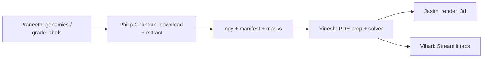

# Philip-Chandan — Brain MRI / Segmentation Pipeline Plan

You own **Person 5: Imaging Pipeline** in this folder. Your job is to get **real starting tumor volumes** from longitudinal glioma MRI (with **expert segmentations**, not Otsu heuristics), process them into **clean 3D numpy arrays**, and hand them to **Vinesh** for PDE growth simulation.

Philip and Chandan work as **one unit** — same deliverables, same schedule, same code.

Pattern reference (breast, completed): `breast-cancer-sim/simulation-vinesh-philip-chandan/philip-chandan/PLAN.md`

---

## Current status — greenfield

Brain-cancer-sim is forked from the breast layout but **imaging code is written fresh here**. Solver + viz are ported; cohort download and NIfTI export are **not started**.

| Doc | Purpose |
|-----|---------|
| [`../../DATASETS.md`](../../DATASETS.md) | Candidate longitudinal MRI datasets |
| [`../handoff_contract.json`](../handoff_contract.json) | Versioned Philip-Chandan ↔ Vinesh contract |
| [`VALIDATION.md`](VALIDATION.md) | QC + napari inspection guide |
| [`report.md`](report.md) / [`PIPELINE_REPORT.pdf`](PIPELINE_REPORT.pdf) | Phase 0 pipeline narrative (regenerate: `generate_pipeline_report.py`) |
| [`cohort/COHORT.md`](cohort/COHORT.md) | Patient picks and discovery notes |

**Spike target (TBD):** one UCSF Longitudinal Glioma patient · baseline MR + expert mask

**Split:** You deliver **raw** MR extract + spacing + segmentation path to `data/processed/raw-extract-philip-chandan/`. Vinesh owns resample/crop/normalize → `data/processed/pde-input-vinesh/` and `solve_growth()`.

---

## Mission & success criteria

| Deliverable | Done when |
|-------------|-----------|
| **Dataset chosen + 1 patient downloaded** | UCSF (or MU-Glioma-Post) baseline MR + mask on disk |
| **`nifti_extractor.py` implemented** | `extract_volume(nifti_path) → np.ndarray` works locally |
| **Spike raw extract** | Raw `.npy` + `.json` in `data/processed/raw-extract-philip-chandan/` |
| **Expert mask paired** | Mask in `data/processed/segmentations/` aligned to MR `(Z, Y, X)` |
| **PDE-ready volume (via Vinesh)** | Vinesh writes `data/processed/pde-input-vinesh/` after your handoff |
| **`manifest.json`** | Maps disease grade / timepoint → slug → paths + metadata |
| **Handoff to Vinesh** | `solve_growth()` runs on real data without reformatting on Vinesh's side |

**Out of scope for v1:** PyRadiomics feature extraction, MS lesion datasets (see stretch below).

---

## Your responsibilities

| Area | What you do |
|------|-------------|
| **Discovery & coordination** | Pick dataset + patients; align IDs with Praneeth (genomics); keep backups |
| **Download & QC** | Pull NIfTI into `data/raw/`; visual slice checks; napari overlay |
| **Extraction (your scope)** | NIfTI → 3D stack `(Z, Y, X)` float32; export via `export_raw_extract.py` *(stub)* |
| **Segmentation pairing** | Load dataset expert masks; verify shape/spacing match MR |
| **PDE prep (Vinesh scope)** | Resample, normalize, crop — `vinesh/prepare_pde_input.py` *(stub)* |
| **Manifest & handoff** | `handoff_contract.json` now; full `manifest.json` after spike |

---

## Repository layout

```
brain-cancer-sim/
├── DATASETS.md
├── data/                          # gitignored under data/raw/
│   ├── raw/                       # downloaded NIfTI / DICOM
│   │   └── ucsf_glioma/<patient_id>/
│   ├── processed/
│   │   ├── raw-extract-philip-chandan/   # your raw .npy + .json
│   │   ├── segmentations/                # expert masks (.npy or .nii.gz)
│   │   └── pde-input-vinesh/             # Vinesh PDE-ready .npy + .json
│   └── qc/
│       └── slice-plots-philip-chandan/
├── simulation-vinesh-philip-chandan/
│   ├── handoff_contract.json
│   ├── handoff_contract.py
│   ├── philip-chandan/            # this folder
│   │   ├── PLAN.md
│   │   ├── view_volume_napari.py  # QC viewer (demo works today)
│   │   ├── nifti_extractor.py     # TODO
│   │   ├── export_raw_extract.py  # TODO
│   │   ├── qc_slice_plot.py       # TODO
│   │   └── cohort/
│   │       ├── cohort.json
│   │       └── COHORT.md
│   └── vinesh/
│       ├── tumor_pde_solver.py
│       ├── growth_interventions.py
│       ├── run_growth.py
│       └── prepare_pde_input.py   # TODO
├── models-praneeth/               # genomics / risk models (stub)
├── visualization-jasim/
└── app-vihari/
```

---

## Dataset selection (start here)

See [`../../DATASETS.md`](../../DATASETS.md). Recommended first spike:

| Priority | Dataset | Why |
|----------|---------|-----|
| **1** | UCSF Longitudinal Glioma | Repeated scans + expert segmentations; best growth-model fit |
| **2** | MU-Glioma-Post | Similar; post-treatment longitudinal; **~11 GB** on TCIA |
| **3** | LUMIERE | Longitudinal GBM + RANO ratings + auto segmentations (Figshare) |
| **4** | Yale Brain Mets | Metastases variant if glioma access blocked |

**Unlike breast:** we use **NIfTI + expert masks**, not TCIA DICOM + Otsu. Do not copy `tcia_extractor.py` — follow the API shape only.

---

## Suggested implementation order

### Phase 0 — Spike bootstrap *(next)*

1. Register / download one UCSF patient (baseline MR + segmentation).
2. Scaffold `nifti_extractor.py`:
   ```python
   def extract_volume(nifti_path: Path) -> np.ndarray: ...  # (Z, Y, X) float32
   def extract_spacing(nifti_path: Path) -> tuple[float, float, float]: ...
   def load_expert_mask(mask_path: Path, mr_shape: tuple) -> np.ndarray: ...
   ```
3. Implement `export_raw_extract.py` — write sidecar JSON per [`../handoff_contract.json`](../handoff_contract.json).
4. QC with `view_volume_napari.py --slug <slug>` and `qc_slice_plot.py`.
5. Hand off to Vinesh; stay paired until `solve_growth()` succeeds.

### Phase 1 — Two-grade or two-patient demo

- Pick **low vs high grade** (or IDH-wt vs IDH-mut if genomics align) for UI toggle.
- Add follow-up timepoint for longitudinal comparison.
- Publish `manifest.json` v1.0.0.

### Phase 2 — Stretch (post-demo)

- PyRadiomics on cropped tumor ROI (optional; mirror breast `stretch/` layout).
- Longitudinal validation: simulated volume vs follow-up scan.

---

## Handoff contract (locked v1.0.0)

Source: [`../handoff_contract.json`](../handoff_contract.json). Bump `"version"` when outputs change.

| Property | Agreed value |
|----------|--------------|
| **Raw extract (you)** | `(Z, Y, X)` float32, not normalized; spacing in sidecar JSON |
| **Segmentation** | Expert mask, same grid as MR; path in JSON `segmentation_path` |
| **PDE input (Vinesh)** | max `[64, 64, 64]`, spacing `[1, 1, 1]` mm, values `[0, 1]`, tumor **> 0** |
| **Solver defaults** | `timesteps=50`, `dt=0.1`, glioma params in contract |

### Slug naming

```
{disease_slug}_{dataset_slug}_{patient_id}_{timepoint_label}
```

Example: `glioma_ucsf_P001_baseline`

Output paths:

```
data/processed/raw-extract-philip-chandan/{slug}.npy
data/processed/raw-extract-philip-chandan/{slug}.json
data/processed/segmentations/{slug}_mask.nii.gz
data/qc/slice-plots-philip-chandan/{slug}_mid-z.png
```

---

## Team coordination



| Who | When | Message |
|-----|------|---------|
| **Praneeth** | Before patient lock | Confirmed patient IDs + molecular subtype / grade for demo toggle |
| **Vinesh** | After contract read | Expected array shape; `prepare_pde_input.py` stub timeline |
| **Jasim** | After first PDE input | Axis `(Z, Y, X)`; continuous density frames |
| **Vihari** | After manifest | `subtype` or `slug` → `pde_npy` mapping |

---

## Checklist

**Phase 0 (spike)**

- [ ] Dataset access confirmed (UCSF or fallback)
- [ ] `cohort/cohort.json` populated with real patient ID
- [ ] Baseline MR + mask on disk under `data/raw/`
- [ ] `nifti_extractor.py` + unit test on sample NIfTI
- [ ] Raw extract exported to `raw-extract-philip-chandan/`
- [ ] Slice QC PNG saved
- [ ] Vinesh PDE input for one slug
- [ ] `solve_growth()` verified end-to-end

**Demo-ready**

- [ ] Two patients or two grades with baseline extracts
- [ ] `manifest.json` v1.0.0
- [ ] Jasim render without axis flip
- [ ] Vihari disease/grade toggle wired

---

## Scripts to implement (stubs)

| File | Status | Notes |
|------|--------|-------|
| `nifti_extractor.py` | **TODO** | nibabel load; `(Z, Y, X)` convention |
| `export_raw_extract.py` | **TODO** | Contract JSON sidecar |
| `qc_slice_plot.py` | **TODO** | Mid-slice MR + mask overlay |
| `download_mu_glioma_post.py` | **ready** | Metadata via HTTPS; imaging via TCIA Faspex (~11 GB) |
| `cohort/cohort_discovery.py` | **ready** | TCIA + local inventory; validate picks before editing `cohort.json` |
| `../vinesh/prepare_pde_input.py` | **TODO** | Vinesh owns; resample expert mask → PDE grid |

**Working today:** `view_volume_napari.py --demo` (synthetic); solver smoke tests in `../vinesh/test_solver.py`.

---

## Setup

```bash
cd brain-cancer-sim
python3.11 -m venv .venv && source .venv/bin/activate
pip install -r requirements.txt

# Solver smoke test
python simulation-vinesh-philip-chandan/vinesh/test_solver.py

# Napari demo (no data required)
python simulation-vinesh-philip-chandan/philip-chandan/view_volume_napari.py --demo
```
