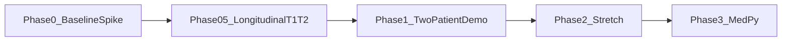
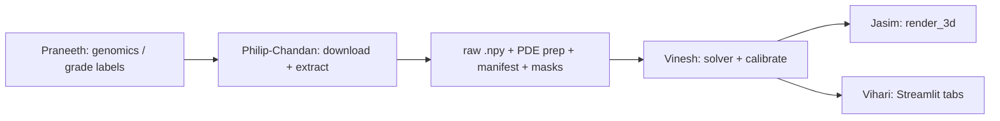

# Philip-Chandan — Brain MRI / Segmentation Pipeline Plan

You own **Person 5: Imaging Pipeline** in this folder. Your job is to get **real starting tumor volumes** from longitudinal glioma MRI (with **expert segmentations**, not Otsu heuristics), process them into **clean 3D numpy arrays**, run **PDE prep** (`prepare_pde_input.py`), and hand solver-ready cubes to **Vinesh** for PDE growth simulation.

Philip and Chandan work as **one unit** — same deliverables, same schedule, same code.

Pattern reference (breast, completed): `breast-cancer-sim/simulation-vinesh-philip-chandan/philip-chandan/PLAN.md`

---

## Current status — Phase 0.5 cohort scale-up *(mostly complete)*

**Work from this section first:** manifest + Vinesh calibration.

| Doc | Purpose |
|-----|---------|
| [`../../DATASETS.md`](../../DATASETS.md) | Candidate longitudinal MRI datasets |
| [`../handoff_contract.json`](../handoff_contract.json) | Versioned Philip-Chandan ↔ Vinesh contract (`1.0.0`) |
| [`VALIDATION.md`](VALIDATION.md) | QC + napari inspection guide |
| [`report.md`](report.md) / [`PIPELINE_REPORT.pdf`](PIPELINE_REPORT.pdf) | Live pipeline narrative — **regenerate:** `generate_pipeline_report.py` |
| [`cohort/COHORT.md`](cohort/COHORT.md) | Patient picks and discovery notes |

**Spike case:** UCSF-ALPTDG patient `100002` · IDH-mut grade 2 oligodendroglioma · slugs `glioma_ucsf_100002_{baseline,followup}`

**Cohort export (7 patients on disk):** `100002`, `100118`, `100130`, `100134`, `100192`, `100220`, `100260` — baseline + follow-up raw `.npy` + JSON under `raw-extract-philip-chandan/<patient_id>/`. PDE g64 cubes under `pde-input-vinesh/<patient_id>/g64/{baseline,followup}.npy`. Longitudinal QC PNGs: `data/qc/slice-plots-philip-chandan/<patient_id>_longitudinal_mid-z-overlay.png`. WT volume table: `wt_volume_report.json`. PDE burden compare: `pde-input-vinesh/pde_burden_compare.json`.

**Resection cavity exclusion (label 4):** Five patients have BraTS label 4 (resection cavity) on at least one visit: `100130`, `100134`, `100192`, `100220`, `100260`. WT volumes use labels 1+2+3 only; PDE prep seeds `mask > 0`, so burden capture is misleading for these cases. **`PIPELINE_REPORT.pdf` §7–8 tables include only the two patients without RC:** `100002` (spike) and `100118` (demo contrast). Full export artifacts for all seven remain on disk for audit.

**Scale-up order:**

1. Baseline spike green — **done** (raw + PDE g64 + solver smoke on `100002`)
2. Longitudinal pair on same patient (t1→t2) — **done** for `100002` raw + PDE g64; calibrated sim pending (Vinesh)
3. Seven-patient cohort raw export — **done** (`export_all_raw.py`, checkpointed)
4. WT volume QC + longitudinal overlay PNGs — **done** (`wt_volume_report.py`; overlays on disk, not embedded in PDF)
5. PDE prep g64 for full cohort (7 × baseline + follow-up) — **done**
6. PDE burden compare + pipeline PDF — **done** (`pde_burden_compare.py`, `PIPELINE_REPORT.pdf` with Fig 4 baseline/follow-up PDE input; cohort MR overlays removed from PDF)
7. `manifest.json` v1.0.0 — **done** (2 non-resection patients: `100002`, `100118`)
8. Vinesh `calibrate.py` + demo toggle (`100118` vs `100002`) — **pending**
9. Jasim render + Vihari toggle — **waiting on manifest + calibrated frames**

**Split:** You deliver **raw** MR extract + spacing + segmentation path to `data/processed/raw-extract-philip-chandan/`, then run **`prepare_pde_input.py`** (resample/crop/normalize → `data/processed/pde-input-vinesh/`). Vinesh owns `run_growth()` and porting `calibrate.py`.

### Who owns what next

| Owner | Next action |
|-------|-------------|
| **Philip-Chandan** | Regenerate `PIPELINE_REPORT.pdf` after QC changes; notify Vinesh of manifest paths |
| **Vinesh** | Port `calibrate.py` + `make_growth_animation.py` (expert-mask seeding, not breast Otsu); `run_growth()` on Philip-Chandan PDE inputs |
| **Praneeth / Jasim / Vihari** | Not blocking t1→t2 on patient 1 |

---

## Mission & success criteria

| Deliverable | Done when |
|-------------|-----------|
| **Dataset chosen + 1 patient downloaded** | UCSF baseline MR + mask on disk — **done** (`100002`) |
| **`nifti_extractor.py` implemented** | `extract_volume(nifti_path) → np.ndarray` works locally — **done** |
| **Spike raw extract** | Raw `.npy` + `.json` in `data/processed/raw-extract-philip-chandan/` — **done** (baseline + follow-up) |
| **Expert mask paired** | Mask in `data/processed/segmentations/` aligned to MR `(Z, Y, X)` — **done** |
| **PDE-ready volume (your scope)** | You run `prepare_pde_input.py` → `data/processed/pde-input-vinesh/<patient_id>/g64/` — **done** (7 patients × baseline + follow-up g64) |
| **`manifest.json`** | Maps disease grade / timepoint → slug → paths + metadata — **done** (2 patients; `generate_manifest.py`) |
| **Handoff to Vinesh** | `solve_growth()` runs on real data without reformatting on Vinesh's side — **done** (baseline smoke); calibrated t1→t2 pending |

**Out of scope for v1:** PyRadiomics feature extraction, MS lesion datasets (see stretch below).

---

## Your responsibilities

| Area | What you do |
|------|-------------|
| **Discovery & coordination** | Pick dataset + patients; align IDs with Praneeth (genomics); keep backups |
| **Download & QC** | Pull NIfTI into `data/raw/`; visual slice checks; napari overlay |
| **Extraction (your scope)** | NIfTI → 3D stack `(Z, Y, X)` float32; export via `export_raw_extract.py` |
| **Segmentation pairing** | Load dataset expert masks; verify shape/spacing match MR |
| **Longitudinal handoff** | Export **both** timepoints per patient; document baseline/followup slug pair + `interval_days` in manifest |
| **PDE prep (your scope)** | Resample, normalize, crop — run `../vinesh/prepare_pde_input.py` after each raw export; QC via `qc_pde_plot.py` |
| **Manifest & handoff** | `handoff_contract.json` now; full `manifest.json` after spike pair green |

---

## Repository layout

```
brain-cancer-sim/
├── DATASETS.md
├── data/                          # gitignored under data/raw/
│   ├── raw/
│   │   └── ucsf_alptdg/<patient_id>/   # e.g. 100002_time1_t1ce.nii.gz
│   ├── processed/
│   │   ├── raw-extract-philip-chandan/   # raw .npy + .json per patient
│   │   │   └── <patient_id>/             # e.g. 100002/baseline.npy + baseline.json
│   │   ├── segmentations/                # expert masks (.nii.gz), flat slug names
│   │   └── pde-input-vinesh/             # solver-ready cubes per patient
│   │       └── <patient_id>/
│   │           └── g64/                  # 64³ solver grid
│   │               ├── baseline.npy + baseline.json
│   │               └── followup.npy + followup.json
│   └── qc/
│       ├── slice-plots-philip-chandan/
│       └── pde-prep-vinesh/
├── simulation-vinesh-philip-chandan/
│   ├── handoff_contract.json
│   ├── handoff_contract.py
│   ├── spike_paths.py
│   ├── philip-chandan/            # this folder
│   │   ├── PLAN.md
│   │   ├── report.md
│   │   ├── generate_pipeline_report.py
│   │   ├── view_volume_napari.py
│   │   ├── nifti_extractor.py
│   │   ├── export_raw_extract.py
│   │   ├── qc_slice_plot.py
│   │   ├── qc_pde_plot.py
│   │   ├── tests/
│   │   └── cohort/
│   │       ├── cohort.json
│   │       ├── cohort_discovery.py
│   │       └── COHORT.md
│   └── vinesh/
│       ├── tumor_pde_solver.py
│       ├── growth_interventions.py
│       ├── run_growth.py
│       ├── mask_seeding.py
│       ├── prepare_pde_input.py
│       └── calibrate.py             # TODO — port from breast
├── models-praneeth/               # genomics / risk models (stub)
├── visualization-jasim/
└── app-vihari/
```

---

## Dataset selection

See [`../../DATASETS.md`](../../DATASETS.md). Primary spike uses UCSF; fallbacks if access blocked:

| Priority | Dataset | Why |
|----------|---------|-----|
| **1** | UCSF Longitudinal Glioma | Repeated scans + expert segmentations; best growth-model fit — **active** |
| **2** | MU-Glioma-Post | Similar; post-treatment longitudinal; **~11 GB** on TCIA |
| **3** | LUMIERE | Longitudinal GBM + RANO ratings + auto segmentations (Figshare) |
| **4** | Yale Brain Mets | Metastases variant if glioma access blocked |

**Unlike breast:** we use **NIfTI + expert masks**, not TCIA DICOM + Otsu. Do not copy `tcia_extractor.py` — follow the API shape only.

Demo contrast pair (Phase 1): `100002` (IDH-mut, grade 2, stable) vs `100118` (IDH-WT GBM, grade 4, +609% WT growth over 56d) — see [`cohort/cohort.json`](cohort/cohort.json).

---

## Suggested implementation order



### Phase 0 — Spike bootstrap *(complete)*

1. Register / download one UCSF patient (baseline MR + segmentation) — **done** (`100002`).
2. Implement `nifti_extractor.py` — **done**:
   ```python
   def extract_volume(nifti_path: Path) -> np.ndarray: ...  # (Z, Y, X) float32
   def extract_spacing(nifti_path: Path) -> tuple[float, float, float]: ...
   def load_expert_mask(mask_path: Path, mr_shape: tuple) -> np.ndarray: ...
   ```
3. Implement `export_raw_extract.py` — **done** (baseline via CLI; see Known gaps for multi-timepoint).
4. QC with `view_volume_napari.py --slug <slug>` and `qc_slice_plot.py` — **done** (baseline).
5. Hand off to Vinesh; stay paired until `solve_growth()` succeeds — **done** (baseline smoke).

### Phase 0.5 — Longitudinal t1→t2 on `100002` *(export done; calibration next)*

Export both timepoints so Vinesh can simulate growth from timepoint 1 to timepoint 2 (183 days; WT volume 8137 → 8365 mm³, ~+2.8%).

1. **Philip-Chandan:** both raw extracts + masks — **done** for full cohort (7 × 2 timepoints).
2. **Philip-Chandan:** PDE prep g64 for all cohort slugs — **done**.
3. **Philip-Chandan:** WT volume report, PDE burden compare, pipeline PDF — **done** (PDF excludes five resection-cavity patients from §7–8 tables).
4. **Vinesh:** port breast [`calibrate.py`](../vinesh/calibrate.py) — tune solver so simulated burden matches real follow-up (expert-mask seeding via `mask_seeding.py`, not breast Otsu `isolate_tumor`).
5. **Optional:** growth animation GIF (breast `make_growth_animation.py` pattern).
6. **Philip-Chandan:** publish `manifest.json` v1.0.0 with paired slugs + `interval_days` + calibrated params.

When Philip-Chandan supply a follow-up scan, Vinesh calibrates growth so simulation reproduces baseline→followup change — same intent as breast `calibrate.py`.

### Phase 1 — Two-grade or two-patient demo

- Export baseline (+ follow-up) for **`100118`** (IDH-WT GBM) alongside `100002`.
- Publish `manifest.json` v1.0.0 — maps grade / IDH / timepoint → slug → paths.
- Notify Praneeth (genomics labels), Jasim (render), Vihari (toggle).

### Phase 2 — Stretch (post-demo)

- PyRadiomics on cropped tumor ROI (optional; mirror breast `stretch/` layout).
- Longitudinal validation metrics: simulated volume vs follow-up scan (analysis after Phase 0.5 calibration works).

### Phase 3 — MedPy cleanup *(low priority — after end-to-end)*

**Do not start until:** spike → calibrated t1→t2 verified → Jasim render sign-off → Vihari toggle wired (checklist below green).

**Package:** `medpy` is already in [`../../requirements.txt`](../../requirements.txt). Swap internals only; preserve handoff contract shapes and test signatures.

| Priority | File | Current brittle pattern | MedPy replacement | Owner |
|----------|------|-------------------------|-------------------|-------|
| 1 | `../vinesh/prepare_pde_input.py` | `scipy.ndimage.zoom` + manual spacing factors | `medpy.filter.resample` (MR: bspline; mask: nearest) | Philip-Chandan — coordinate with Vinesh before merge |
| 2 | `../vinesh/prepare_pde_input.py` | Hand-rolled `_crop_or_pad_centered` | `medpy.filter.bounding_box` + `medpy.filter.pad` | Philip-Chandan |
| 3 | Breast `stretch/prep_volume.py` + `vinesh/calibrate.py` | Duplicated Otsu + largest-CC (`skimage` + `scipy.label`) | `medpy.filter.otsu` + `largest_connected_component` — one shared helper | Philip-Chandan (breast only; not brain v1) |
| 4 | Breast `stretch/validate_segmentation.py` | Hand-rolled `dice_coefficient` / `volume_mm3` | `medpy.metric.dc`; optional `hd95` / `assd` for `.les` report | Philip-Chandan |

**Keep as-is (MedPy does not help):** nibabel load in `nifti_extractor.py`, `mask_seeding.py` distance ramp (`scipy.ndimage`), PDE Laplacian in `tumor_pde_solver.py`, napari WW/WL/CLAHE in `view_volume_napari.py`, TCIA/cohort download.

**Migration rule:** swap internals, not filenames; bump [`../handoff_contract.json`](../handoff_contract.json) `version` only if resample/crop outputs change.

---

## Handoff contract (locked v1.0.0)

Source: [`../handoff_contract.json`](../handoff_contract.json). Bump `"version"` when outputs change.

| Property | Agreed value |
|----------|--------------|
| **Raw extract (you)** | `(Z, Y, X)` float32, not normalized; spacing in sidecar JSON |
| **Segmentation** | Expert mask, same grid as MR; path in JSON `segmentation_path` |
| **PDE input (you)** | `grid_size_options`: 64 only; spacing `[1, 1, 1]` mm; values `[0, 1]`; tumor **> 0** — produced by `prepare_pde_input.py` |
| **Solver defaults** | `timesteps=50`, `dt=0.1`, glioma params in contract |

**Note:** contract `spike_patient` lists **baseline only** (`glioma_ucsf_100002_baseline`). Paired longitudinal metadata (follow-up slug, `interval_days`) will live in **`manifest.json`** (optional future contract bump).

### Slug naming

```
{disease_slug}_{dataset_slug}_{patient_id}_{timepoint_label}
```

Example: `glioma_ucsf_100002_baseline`

Output paths (patient-id layout; full slug retained in JSON metadata):

```
data/processed/raw-extract-philip-chandan/<patient_id>/{timepoint}.npy
data/processed/raw-extract-philip-chandan/<patient_id>/{timepoint}.json
data/processed/segmentations/{slug}_mask.nii.gz
data/qc/slice-plots-philip-chandan/{slug}_mid-z-overlay.png
data/processed/pde-input-vinesh/<patient_id>/g64/{timepoint}.npy
data/processed/pde-input-vinesh/<patient_id>/g64/{timepoint}.json
```

Example for spike patient `100002` baseline: slug `glioma_ucsf_100002_baseline` → `100002/baseline.npy`.

---

## Team coordination



| Who | When | Message |
|-----|------|---------|
| **Praneeth** | Before UI lock | Confirm `100118` vs `100002` IDs + IDH/grade for demo toggle (cohort already drafted) |
| **Vinesh** | Now | Port `calibrate.py` for t1→t2 on `100002`; consume Philip-Chandan PDE inputs |
| **Jasim** | After calibrated frames | Axis `(Z, Y, X)`; continuous density frames |
| **Vihari** | After manifest | `subtype` or `slug` → `pde_npy` mapping |

Live narrative: [`report.md`](report.md) / [`PIPELINE_REPORT.pdf`](PIPELINE_REPORT.pdf).

---

## Checklist

**Phase 0 (spike)**

- [x] Dataset access confirmed (UCSF)
- [x] `cohort/cohort.json` populated with real patient ID (`100002`)
- [x] Baseline MR + mask on disk under `data/raw/ucsf_alptdg/`
- [x] `nifti_extractor.py` + unit test on sample NIfTI
- [x] Baseline raw extract exported to `raw-extract-philip-chandan/`
- [x] Baseline slice QC PNG saved
- [x] PDE input for baseline slug via `prepare_pde_input.py` (g64)
- [x] `solve_growth()` verified end-to-end on baseline

**Phase 0.5 (longitudinal t1→t2 on `100002`)**

- [x] Follow-up raw extract + mask (`glioma_ucsf_100002_followup`)
- [x] Follow-up slice QC PNG
- [x] Follow-up PDE input g64 (`100002/g64/followup.npy`)
- [x] Cohort-driven export CLI — 7 patients × 2 timepoints (`export_all_raw.py`)
- [x] WT volume report + UCSF workbook compare (`wt_volume_report.json`)
- [x] Longitudinal before/after overlay PNGs (7 patients, on disk)
- [x] PDE input g64 for all 7 patients × baseline + follow-up (`pde-input-vinesh/<patient_id>/g64/`)
- [x] PDE prep QC PNGs for full cohort (`data/qc/pde-prep-vinesh/g64/`)
- [x] PDE burden compare JSON (`pde_burden_compare.json`; full cohort)
- [x] `PIPELINE_REPORT.pdf` — Fig 4 baseline/follow-up PDE input; §7–8 tables for non-resection patients only
- [ ] Brain `calibrate.py` ported and run on baseline→followup pair
- [ ] Document calibrated params + interval in manifest

**Demo-ready** *(depends on Phase 0.5 + Phase 1)*

- [x] Seven UCSF patients with baseline + follow-up raw extracts
- [x] Seven UCSF patients with baseline + follow-up PDE g64 inputs
- [ ] Two patients or two grades highlighted for demo toggle (`100002` + `100118`)
- [x] `manifest.json` v1.0.0 (2 patients: `100002`, `100118`)
- [ ] Jasim render without axis flip
- [ ] Vihari disease/grade toggle wired

---

## Scripts

| File | Status | Notes |
|------|--------|-------|
| `nifti_extractor.py` | **done** | nibabel load; `(Z, Y, X)` convention |
| `export_raw_extract.py` | **partial** | Core export works; use `export_all_raw.py` for cohort |
| `export_all_raw.py` | **done** | Cohort + multi-timepoint export; checkpoint; `--compare-ucsf-workbook` |
| `wt_volume_report.py` | **done** | WT mm³ from expert seg (labels 1+2+3); UCSF workbook diff |
| `pde_burden_compare.py` | **done** | PDE g64 voxel burden vs WT growth %; `label_inflation_*` flags for RC patients |
| `generate_manifest.py` | **done** | → `manifest.json` v1.0.0 (2 non-resection patients) |
| `qc_slice_plot.py` | **done** | Per-slug mid-Z + `{patient_id}_longitudinal_mid-z-overlay.png` |
| `view_volume_napari.py` | **done** | Clinical QC + `--pde-input` |
| `qc_pde_plot.py` | **done** | PDE prep QC figures under `data/qc/pde-prep-vinesh/` |
| `generate_pipeline_report.py` | **done** | → `PIPELINE_REPORT.pdf` |
| `download_mu_glioma_post.py` | **ready** | Metadata via HTTPS; imaging via TCIA Faspex (~11 GB) |
| `cohort/cohort_discovery.py` | **ready** | TCIA + local inventory; validate picks before editing `cohort.json` |
| `../vinesh/prepare_pde_input.py` | **done** (7 × baseline + follow-up g64) | Per-slug CLI; batch via loop over raw JSON slugs |
| `../vinesh/calibrate.py` | **TODO (Vinesh)** | Port from breast for t1→t2 calibration |

**Working today:** solver smoke tests in `../vinesh/test_solver.py`; napari `--demo` (synthetic) or `--slug glioma_ucsf_100002_baseline --pde-input` (real data).

### Batch export — `export_all_raw.py`

Loops `cohort.json` and calls `export_raw_extract()` + QC per slug. Checkpoint: `data/processed/raw-extract-philip-chandan/.export_all_raw.state.json`.

```bash
# All primary patients (resumes by default)
python simulation-vinesh-philip-chandan/philip-chandan/export_all_raw.py --all-primary

# Single patient
python simulation-vinesh-philip-chandan/philip-chandan/export_all_raw.py --patient-id 100002

# Clean restart
python simulation-vinesh-philip-chandan/philip-chandan/export_all_raw.py --all-primary --fresh

# Monitor progress
jq '{status: .run_status, current: .current_job_id, summary: .summary}' \
  data/processed/raw-extract-philip-chandan/.export_all_raw.state.json
```

Also: `--timepoints`, `--no-qc`, `--resume` / `--no-resume`, `--force`, `--retry-failed`, `--status-file PATH`.

---

## Known gaps

1. **`export_raw_extract.py`** — single-spike CLI only; use `export_all_raw.py` for cohort batches (checkpointed).
2. **`handoff_contract.json`** — `spike_patient` is baseline-only; paired longitudinal metadata belongs in `manifest.json`.
3. **No brain `calibrate.py`** — blocks t1→t2 simulation despite follow-up PDE inputs on disk.
4. **Resection cavity (label 4)** — five cohort patients seed PDE from cavity voxels; excluded from PDF QC tables until PDE prep filters label 4 (future contract bump).
5. **`manifest.json`** — published for 2 non-resection patients; five RC cases remain on disk only.

---

## Setup

```bash
cd brain-cancer-sim
python3.11 -m venv .venv && source .venv/bin/activate
pip install -r requirements.txt

# Solver smoke test
.venv/bin/python simulation-vinesh-philip-chandan/vinesh/test_solver.py

# Napari demo (no data required)
.venv/bin/python simulation-vinesh-philip-chandan/philip-chandan/view_volume_napari.py --demo

# Export baseline spike (default)
.venv/bin/python simulation-vinesh-philip-chandan/philip-chandan/export_raw_extract.py

# PDE prep (Philip-Chandan) — baseline
.venv/bin/python simulation-vinesh-philip-chandan/vinesh/prepare_pde_input.py --slug glioma_ucsf_100002_baseline

# Napari QC on real spike
.venv/bin/python simulation-vinesh-philip-chandan/philip-chandan/view_volume_napari.py --slug glioma_ucsf_100002_baseline --pde-input
```

Regenerate pipeline PDF (§7–8 show non-resection patients only; Fig 4 = baseline/follow-up PDE input):

```bash
.venv/bin/python simulation-vinesh-philip-chandan/philip-chandan/export_all_raw.py \
  --all-primary --volume-report-only --compare-ucsf-workbook
# PDE prep — all cohort slugs (g64)
for f in data/processed/raw-extract-philip-chandan/*/{baseline,followup}.json; do
  slug=$(.venv/bin/python -c "import json; print(json.load(open('$f'))['slug'])")
  .venv/bin/python simulation-vinesh-philip-chandan/vinesh/prepare_pde_input.py --slug "$slug" --grid-size 64
  .venv/bin/python simulation-vinesh-philip-chandan/philip-chandan/qc_pde_plot.py --slug "$slug" --grid-size 64
done
.venv/bin/python simulation-vinesh-philip-chandan/philip-chandan/generate_pipeline_report.py
```
