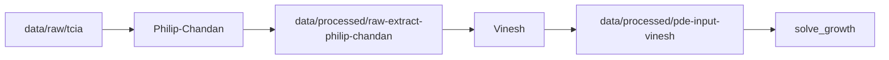

# Option B spike — one patient, parallel Philip-Chandan / Vinesh

Shared plan for the **first end-to-end path** before scaling to two subtypes or follow-up timepoints.

**Scope:** `TCGA-AR-A1AX` · Luminal A · baseline `2002-09-12`

**Strategy (Option B):** Philip-Chandan delivers **raw** DICOM extract + spacing. Vinesh owns **resample, crop, normalize for PDE**, and `solve_growth()`.

---

## Parallel folders

| Owner | Path | Purpose |
|-------|------|---------|
| Philip-Chandan | `data/raw/tcia/` | DICOM downloads (existing layout) |
| Philip-Chandan | `data/processed/raw-extract-philip-chandan/` | Raw `(Z,Y,X)` float32 `.npy` + sidecar `.json` |
| Philip-Chandan | `data/qc/slice-plots-philip-chandan/` | Middle-slice PNGs for visual QC |
| Vinesh | `data/processed/pde-input-vinesh/` | Resampled/cropped array ready for `solve_growth()` |
| Vinesh | `data/qc/solver-runs-vinesh/` | Test frame dumps / solver debug output |

Create folders once:

```bash
cd breast-cancer-sim
python simulation-vinesh-philip-chandan/spike_paths.py
```

Path constants live in [`spike_paths.py`](spike_paths.py).

---

## Contract (lock in Slack before coding assumptions)

### Philip-Chandan → Vinesh (`raw-extract-philip-chandan/`)

| Field | Value |
|-------|--------|
| Files | `{slug}.npy` + `{slug}.json` |
| Slug (spike) | `luminal_a_TCGA-AR-A1AX_baseline` |
| Array shape | `(Z, Y, X)` — native DICOM stack, **not** resampled |
| Dtype | `float32` |
| Values | Raw MR intensity (HU-like scanner units), **not** normalized |
| JSON sidecar | `spacing_mm` `[dz, dy, dx]`, `tcga_id`, `subtype`, `study_date`, `source_dicom_dir`, `shape`, `dtype`, optional `series_description` |

Vinesh should **not** re-read DICOM for the spike — only these two files.

### Vinesh → demo (`pde-input-vinesh/`)

| Field | Recommendation |
|-------|----------------|
| Files | `{slug}.npy` + `{slug}.json` |
| Shape | ≤ `64×64×64` or `128×128×128` (agree in Slack) |
| Spacing | Isotropic `1.0` mm (document in JSON) |
| Values | `[0, 1]` — background 0, initial tumor burden > 0 |
| Axis | Still `(Z, Y, X)` |

---

## Work split



| Step | Owner | Done when |
|------|-------|-----------|
| 1. Download | Philip-Chandan | `.../luminal_a/TCGA-AR-A1AX/2002-09-12/` has one contrast series |
| 2. Download QC | Philip-Chandan | `validate_series` → `ok=True`, spacing present |
| 3. Raw extract + export | Philip-Chandan | `.npy` + `.json` in `raw-extract-philip-chandan/` |
| 4. Visual QC | Philip-Chandan | Middle-slice PNG in `slice-plots-philip-chandan/` looks sane |
| 5. Load raw + resample/crop | Vinesh | `pde-input-vinesh/{slug}.npy` exists |
| 6. PDE input manifest | Vinesh | `{slug}.json` documents shape, spacing, value semantics |
| 7. Integration | Both | `solve_growth(pde_input)` runs once; fix contract mismatches together |

Detailed checklists:

- Philip-Chandan: [`philip-chandan/SPIKE_CHECKLIST.md`](philip-chandan/SPIKE_CHECKLIST.md)
- Vinesh: [`vinesh/SPIKE_CHECKLIST.md`](vinesh/SPIKE_CHECKLIST.md)

---

## Commands (Philip-Chandan)

```bash
cd breast-cancer-sim
source .venv/bin/activate

# If not already downloaded
python simulation-vinesh-philip-chandan/philip-chandan/download_tcia.py \
  --tcga-id TCGA-AR-A1AX --subtype "Luminal A" --longitudinal

# Create spike folders + export raw extract
python simulation-vinesh-philip-chandan/spike_paths.py
python simulation-vinesh-philip-chandan/philip-chandan/export_raw_extract.py
```

## Commands (Vinesh)

```bash
cd breast-cancer-sim
source .venv/bin/activate

# After Philip-Chandan drops files in raw-extract-philip-chandan/
python simulation-vinesh-philip-chandan/vinesh/prepare_pde_input.py

# Then wire into solver
python -c "
import numpy as np
from pathlib import Path
from simulation_vinesh_philip_chandan.vinesh.tumor_pde_solver import solve_growth
# or adjust import to your local layout
vol = np.load('data/processed/pde-input-vinesh/luminal_a_TCGA-AR-A1AX_baseline.npy')
frames = solve_growth(vol, timesteps=50, dt=0.1, params={'risk_multiplier': 1.2})
print(len(frames), frames[0].shape)
"
```

---

## Spike complete → scale up

After step 7 is green for this one case:

1. Repeat export for `TCGA-AR-A1AQ` / `2001-11-21` (Basal baseline).
2. Add subtype toggle / manifest at demo layer (Vihari/Jasim).
3. Follow-up timepoints stay optional until baseline demo works.

---

## Code ownership

| Directory | Owner |
|-----------|--------|
| `philip-chandan/` | Philip-Chandan — DICOM, extract, raw export |
| `vinesh/` | Vinesh — `prepare_pde_input`, `solve_growth`, solver QC |
| `spike_paths.py`, `HANDOFF_SPIKE.md` | Shared — change together if paths or contract shift |
