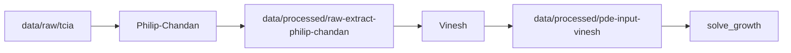

# Option B spike — one patient, parallel Philip-Chandan / Vinesh

Shared plan for the **first end-to-end path** before scaling to two subtypes or follow-up timepoints.

**Scope:** `TCGA-AR-A1AX` · Luminal A · baseline `2002-09-12`

**Strategy (Option B):** Philip-Chandan delivers **raw** DICOM extract + spacing. Vinesh owns **resample, crop, normalize for PDE**, and `solve_growth()`.

---

## Handoff contract (source of truth)

**All numeric and semantic agreement lives in one versioned file:**

[`handoff_contract.json`](handoff_contract.json)

Load in Python:

```python
from handoff_contract import (
    contract_version,
    load_handoff_contract,
    pde_input_spec,
    raw_extract_spec,
    solver_spec,
    spike_patient,
)
```

**To change shape, spacing, solver defaults, or spike patient:** edit `handoff_contract.json`, bump `"version"`, and tell the other person to pull. Do not hardcode new numbers in `prepare_pde_input.py` or `export_raw_extract.py`.

### Agreed values (`version` **1.0.0**)

| Setting | Value |
|---------|--------|
| Spike slug | `luminal_a_TCGA-AR-A1AX_baseline` |
| Raw axis order | `(Z, Y, X)` |
| Raw dtype | `float32`, **not** normalized |
| PDE max shape | `[64, 64, 64]` |
| PDE target spacing | `[1.0, 1.0, 1.0]` mm |
| PDE value range | `[0.0, 1.0]` |
| Tumor rule | values **> 0** = initial burden |
| Segmentation | `otsu` (Vinesh-owned) |
| Solver defaults | `timesteps=50`, `dt=0.1`, `risk_multiplier=1.2` |

Sidecar JSON files written by export scripts include `"contract_version"` so you can detect mismatches.

---

## Parallel folders

| Owner | Path | Purpose |
|-------|------|---------|
| Philip-Chandan | `data/raw/tcia/` | DICOM downloads (existing layout) |
| Philip-Chandan | `data/processed/raw-extract-philip-chandan/` | Raw `(Z,Y,X)` float32 `.npy` + sidecar `.json` |
| Philip-Chandan | `data/qc/slice-plots-philip-chandan/` | Middle-slice PNGs for visual QC |
| Vinesh | `data/processed/pde-input-vinesh/` | Resampled/cropped array ready for `solve_growth()` |
| Vinesh | `data/qc/solver-runs-vinesh/` | Test frame dumps / solver debug output |

Create folders once:

```bash
cd breast-cancer-sim
python simulation-vinesh-philip-chandan/spike_paths.py
```

Path constants live in [`spike_paths.py`](spike_paths.py). Contract constants live in [`handoff_contract.json`](handoff_contract.json).

---

## Work split



| Step | Owner | Done when |
|------|-------|-----------|
| 1. Download | Philip-Chandan | `.../luminal_a/TCGA-AR-A1AX/2002-09-12/` has one contrast series |
| 2. Download QC | Philip-Chandan | `validate_series` → `ok=True`, spacing present |
| 3. Raw extract + export | Philip-Chandan | `.npy` + `.json` in `raw-extract-philip-chandan/` |
| 4. Visual QC | Philip-Chandan | Middle-slice PNG in `slice-plots-philip-chandan/` looks sane |
| 5. Load raw + resample/crop | Vinesh | `pde-input-vinesh/{slug}.npy` exists |
| 6. PDE input manifest | Vinesh | `{slug}.json` documents shape, spacing, value semantics |
| 7. Integration | Both | `solve_growth(pde_input)` runs once; fix contract mismatches together |

Detailed checklists:

- Philip-Chandan: [`philip-chandan/SPIKE_CHECKLIST.md`](philip-chandan/SPIKE_CHECKLIST.md)
- Vinesh: [`vinesh/SPIKE_CHECKLIST.md`](vinesh/SPIKE_CHECKLIST.md)

---

## Commands (Philip-Chandan)

```bash
cd breast-cancer-sim
source .venv/bin/activate

# If not already downloaded
python simulation-vinesh-philip-chandan/philip-chandan/download_tcia.py \
  --tcga-id TCGA-AR-A1AX --subtype "Luminal A" --longitudinal

# Create spike folders + export raw extract
python simulation-vinesh-philip-chandan/spike_paths.py
python simulation-vinesh-philip-chandan/philip-chandan/export_raw_extract.py
```

## Commands (Vinesh — Windows)

Philip-Chandan raw extract is **ready**. `data/` is gitignored — you need to pull code, then get the handoff files locally.

### Option A — Download yourself (recommended)

Open **PowerShell** from the repo root (`QBIHack\breast-cancer-sim`):

```powershell
# 1. Pull latest code (includes download_spike_data.ps1 + handoff contract)
cd path\to\QBIHack
git pull

cd breast-cancer-sim

# 2. If script execution is blocked (one-time)
Set-ExecutionPolicy -Scope CurrentUser RemoteSigned

# 3. Download baseline DICOM from TCIA + build raw handoff (~50 MB download)
.\simulation-vinesh-philip-chandan\download_spike_data.ps1 -ExportRaw
```

Expected output files:

```
data\processed\raw-extract-philip-chandan\luminal_a_TCGA-AR-A1AX_baseline.npy
data\processed\raw-extract-philip-chandan\luminal_a_TCGA-AR-A1AX_baseline.json
```

Verify they exist:

```powershell
Test-Path data\processed\raw-extract-philip-chandan\luminal_a_TCGA-AR-A1AX_baseline.npy
Test-Path data\processed\raw-extract-philip-chandan\luminal_a_TCGA-AR-A1AX_baseline.json
```

Both should print `True`.

### Option B — Philip-Chandan shared the files

If you received the two handoff files (Drive/Slack), create the folder and copy them in:

```powershell
cd path\to\QBIHack\breast-cancer-sim
git pull

New-Item -ItemType Directory -Force -Path data\processed\raw-extract-philip-chandan

# Copy from your Downloads (adjust source paths)
Copy-Item "$env:USERPROFILE\Downloads\luminal_a_TCGA-AR-A1AX_baseline.npy" `
  data\processed\raw-extract-philip-chandan\
Copy-Item "$env:USERPROFILE\Downloads\luminal_a_TCGA-AR-A1AX_baseline.json" `
  data\processed\raw-extract-philip-chandan\
```

### Step 5+ — Your pipeline (after raw extract exists)

```powershell
cd path\to\QBIHack\breast-cancer-sim

# Create output folders
.\.venv\Scripts\python.exe simulation-vinesh-philip-chandan\spike_paths.py

# Implement prepare_pde_input.py first, then run:
.\.venv\Scripts\python.exe simulation-vinesh-philip-chandan\vinesh\prepare_pde_input.py
```

Expected outputs:

```
data\processed\pde-input-vinesh\luminal_a_TCGA-AR-A1AX_baseline.npy
data\processed\pde-input-vinesh\luminal_a_TCGA-AR-A1AX_baseline.json
```

### Step 7 — Test solver (after prepare_pde_input works)

```powershell
cd path\to\QBIHack\breast-cancer-sim\simulation-vinesh-philip-chandan\vinesh

..\..\.venv\Scripts\python.exe -c @"
import numpy as np
from handoff_contract import solver_spec, spike_patient
from tumor_pde_solver import solve_growth

spec = solver_spec()
slug = spike_patient()['slug']
vol = np.load(f'../../data/processed/pde-input-vinesh/{slug}.npy')
frames = solve_growth(
    vol,
    timesteps=spec['timesteps'],
    dt=spec['dt'],
    params=spec['default_params'],
)
print(len(frames), frames[0].shape)
"@
```

### Slack message from Philip-Chandan (copy-paste)

> **Spike raw extract is ready (Option B).**
>
> 1. `git pull`
> 2. In PowerShell from `breast-cancer-sim`:
>    ```powershell
>    .\simulation-vinesh-philip-chandan\download_spike_data.ps1 -ExportRaw
>    ```
>    *(Or ask us for the two files below if you prefer not to download from TCIA.)*
>
> **Handoff files** (contract **1.0.0**):
> - `data\processed\raw-extract-philip-chandan\luminal_a_TCGA-AR-A1AX_baseline.npy`
> - `data\processed\raw-extract-philip-chandan\luminal_a_TCGA-AR-A1AX_baseline.json`
>
> **Metadata:** shape `[352, 256, 256]`, spacing `[3.0, 0.8594, 0.8594]` mm, axis `(Z,Y,X)`, float32, not normalized.
>
> **Your turn:** implement + run `vinesh\prepare_pde_input.py` → `pde-input-vinesh\` → `solve_growth()`.

---

## Commands (Vinesh — macOS/Linux)

```bash
cd breast-cancer-sim
source .venv/bin/activate

# Get raw extract (download + export)
bash simulation-vinesh-philip-chandan/download_spike_data.sh --export-raw

# After raw extract exists
python simulation-vinesh-philip-chandan/spike_paths.py
python simulation-vinesh-philip-chandan/vinesh/prepare_pde_input.py
```

---

## Spike complete → scale up

After step 7 is green for this one case:

1. Repeat export for `TCGA-AR-A1AQ` / `2001-11-21` (Basal baseline).
2. Add subtype toggle / manifest at demo layer (Vihari/Jasim).
3. Follow-up timepoints stay optional until baseline demo works.

---

## Code ownership

| Directory / file | Owner |
|------------------|--------|
| `philip-chandan/` | Philip-Chandan — DICOM, extract, raw export |
| `vinesh/` | Vinesh — `prepare_pde_input`, `solve_growth`, solver QC |
| `handoff_contract.json` | **Shared** — bump version when numbers change |
| `handoff_contract.py`, `spike_paths.py`, `HANDOFF_SPIKE.md` | Shared — loaders and docs |

