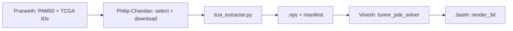
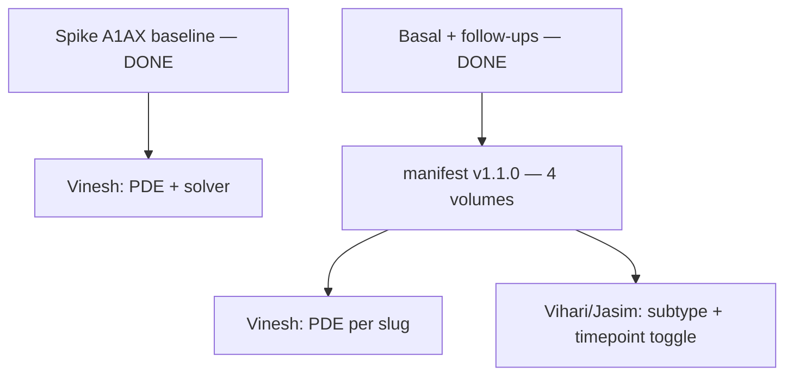

# Philip-Chandan — TCGA/TCIA Radiomics Pipeline Plan

You own **Person 5: Radiomics Pipeline** in this folder. Your job is to get **two real starting tumor volumes** (Luminal A vs Basal) from TCGA-BRCA MRI on TCIA, process them into **clean 3D numpy arrays**, and hand them to **Vinesh** before Day 2 noon. Everything else on the team can proceed with dummy spheres until then.

Philip and Chandan work as **one unit** — same deliverables, same schedule, same code. Pair on everything; split tasks by what's fastest in the moment, not by owner.

---

## Current spike — Option B (active)

**Work from this section first.** The Day 1/Day 2 schedule below is the full sprint; the spike narrows scope to one patient/timepoint with parallel Vinesh ownership of PDE prep.

| Doc | Purpose |
|-----|---------|
| [`../HANDOFF_SPIKE.md`](../HANDOFF_SPIKE.md) | Shared Option B plan (Philip-Chandan + Vinesh) |
| [`../handoff_contract.json`](../handoff_contract.json) | Versioned contract (`1.0.0`) — shape, spacing, solver defaults |
| [`SPIKE_CHECKLIST.md`](SPIKE_CHECKLIST.md) | Your steps 1–4 for the spike |

**Spike case:** `TCGA-AR-A1AX` · Luminal A · baseline `2002-09-12`

**Split:** You deliver **raw** DICOM extract + spacing to `data/processed/raw-extract-philip-chandan/`. Vinesh owns resample/crop/normalize → `data/processed/pde-input-vinesh/` and `solve_growth()`. Do not duplicate his processing in `tcia_extractor.py`.

**Scale-up order:** (1) one baseline spike green → (2) `TCGA-AR-A1AQ` baseline → (3) full two-subtype demo + `manifest.json` → (4) longitudinal follow-ups for both primaries. **Philip-Chandan raw extracts (4 volumes) + manifest v1.1.0 are done** — blocked on Vinesh PDE input per slug.

---

## Mission & Success Criteria

| Deliverable | Done when |
|-------------|-----------|
| **2 DICOM series downloaded** | One Luminal A + one Basal-like TCGA-BRCA case with usable MRI |
| **`tcia_extractor.py` implemented** | `extract_volume(dicom_dir) → np.ndarray` works on local files |
| **Spike raw extract (Option B)** | Raw `.npy` + `.json` in `data/processed/raw-extract-philip-chandan/` for one baseline timepoint |
| **2 PDE-ready volumes (via Vinesh)** | Vinesh writes `data/processed/pde-input-vinesh/` after your raw handoff |
| **`manifest.json`** | Maps subtype → file path → TCGA ID → array metadata (after spike) |
| **Handoff to Vinesh** | `solve_growth()` runs on real data without you reformatting on Vinesh's side |

**Out of scope for the 2-day sprint:** full PyRadiomics feature extraction (Phase 2 stretch). Focus on **DICOM → single 3D volume** that Vinesh can simulate.

---

## Your Responsibilities (all of it)

| Area | What you do |
|------|-------------|
| **Discovery & coordination** | Message Praneeth for TCGA barcodes; pick cases; query TCIA; keep backup IDs |
| **Download & QC** | Pull DICOM into `data/raw/tcia/`; `validate_series`; visual slice checks |
| **Extraction (your scope)** | Raw DICOM → 3D stack via `tcia_extractor.py`; export via `export_raw_extract.py` |
| **PDE prep (Vinesh scope)** | Resample, normalize, segment — `vinesh/prepare_pde_input.py` (see contract) |
| **Manifest & handoff** | `handoff_contract.json` now; full `manifest.json` after spike; fix integration bugs |

---

## Repository Layout (create on Day 1 AM)

```
breast-cancer-sim/
├── data/                          # gitignored — local only
│   ├── raw/tcia/
│   │   └── luminal_a/TCGA-AR-A1AX/
│   │       ├── 2002-09-12/        # spike baseline DICOM
│   │       └── 2003-09-24/        # follow-up (optional until spike green)
│   ├── processed/
│   │   ├── raw-extract-philip-chandan/   # your raw .npy + .json handoff
│   │   └── pde-input-vinesh/             # Vinesh PDE-ready .npy + .json
│   └── qc/
│       ├── slice-plots-philip-chandan/
│       └── solver-runs-vinesh/
└── simulation-vinesh-philip-chandan/
    ├── handoff_contract.json      # versioned Philip-Chandan ↔ Vinesh contract
    ├── HANDOFF_SPIKE.md
    ├── spike_paths.py
    ├── philip-chandan/            # this folder
    │   ├── PLAN.md
    │   ├── SPIKE_CHECKLIST.md
    │   ├── export_raw_extract.py
    │   ├── qc_slice_plot.py
    │   ├── tcia_extractor.py
    │   ├── download_tcia.py
    │   └── cohort/
    └── vinesh/
        ├── SPIKE_CHECKLIST.md
        ├── prepare_pde_input.py
        └── tumor_pde_solver.py
```

**Cohort subfolder:** Shared TCGA barcodes for imaging (Philip-Chandan) and genomics (Praneeth) live under `cohort/`. Use `cohort/cohort_discovery.py` to validate or refresh picks before editing `cohort.json`. Extraction and download scripts still import patient IDs via `tcia_extractor.load_cohort()`.

---

## Day 1 Schedule

### 09:00–10:00 | Kickoff & Infrastructure

1. Clone repo, shared venv:
   ```bash
   cd breast-cancer-sim
   python -m venv .venv && source .venv/bin/activate
   pip install -r requirements.txt
   ```
2. Create `data/raw/tcia/` and `data/processed/volumes/`.
3. Agree on **handoff contract** with Vinesh (see below) — send in Slack before 10:30.
4. Message **Praneeth** for 2 TCGA-BRCA barcodes (Luminal A + Basal).
5. Skim [TCIA TCGA-BRCA collection](https://www.cancerimagingarchive.net/collection/tcga-brca/) and [TCIA REST API docs](https://wiki.cancerimagingarchive.net/display/Public/TCIA+REST+API+Guide).
6. Scaffold `tcia_extractor.py` with `extract_volume`, `save_volume`, `load_manifest`.

### 10:00–12:30 | Download + extractor (interleave as needed)

Work in parallel only when it saves time (e.g. one person kicks off a download while the other codes). Otherwise stay paired on the critical path.

1. **Pick 2 cases** aligned with Praneeth's A/B subtype demo:
   - Luminal A (lower risk)
   - Basal-like (higher risk)
   - Use TCGA clinical + PAM50 from cBioPortal or METABRIC mapping; crosswalk barcode `TCGA-XX-XXXX`.
2. **Query TCIA** for MR series per patient:
   - Collection: `TCGA-BRCA`
   - Prefer **post-contrast T1** or best available 3D-friendly stack
   - TCIA REST example: `getPatient`, `getSeries`, then NBIA or TCIA downloader for DICOM
3. **Download** into `data/raw/tcia/luminal_a/` and `data/raw/tcia/basal/`.
4. **Start first TCIA download by 10:15** — this is the critical path for the whole simulation stack.
5. Implement DICOM → 3D stack with `pydicom` (already in `requirements.txt`):
   - Walk directory, filter by `SOPClassUID` / modality
   - Sort by `InstanceNumber` or `ImagePositionPatient`
   - Build `(Z, Y, X)` float32 array
6. Add **`validate_series(dicom_dir)`** — consistent dimensions, no missing slices.
7. Test `extract_volume()` on the first downloaded folder; if download is slow, use any public TCIA-BRCA sample to unblock.
8. Start **`manifest.json`** with TCGA IDs, series UID, modality, slice count.

**Checkpoint @ 12:00:** At least one DICOM folder on disk + extractor returns a non-empty 3D array.

### 12:30–01:30 | Lunch & Progress Sync

Sync with the team:

| Question for | Why |
|--------------|-----|
| **Praneeth** | Confirmed TCGA IDs for Luminal A vs Basal |
| **Vinesh** | Expected array shape, value range, max size for PDE |
| **Jasim** | Whether volumes need discrete tissue labels (0/1/2) or continuous intensity |

### 01:30–05:00 | Process into simulation-ready volumes

1. **Intensity normalization:** clip outliers, scale to `[0, 1]` (min-max or percentile).
2. **Tumor mask / volume field** (pick one for demo speed):
   - **Fast:** threshold high-intensity voxels → binary mask `{0, 1}`
   - **Better:** simple region growing or Otsu on contrast-enhanced slice
   - Map to tissue semantics Jasim expects: `0 = healthy`, `0.5 = viable`, `1.0 = necrotic` (or let Vinesh assign necrotic during PDE)
3. **Resample** to isotropic spacing (e.g. 1 mm) and **cap size** (e.g. max 128³) so PDE + PyVista stay fast.
4. **Save** `.npy` + update `manifest.json`.
5. Finish second case download if still in progress.
6. Visual QC: middle slice matplotlib check — tumor present, not corrupted.
7. Document any bad series; have **backup case IDs** ready.

**End-of-day target:** Both `.npy` files exist OR one real + one fallback (process a second series from same collection with different subtype label).

---

## Day 2 Schedule

### 09:00–11:30 | Critical handoff (highest priority)

**09:00 — Deliver to Vinesh**

Package:

```
data/processed/volumes/
├── luminal_a_<TCGA-ID>.npy
├── basal_<TCGA-ID>.npy
└── manifest.json
```

**`manifest.json` schema (agree tonight):**

```json
{
  "volumes": [
    {
      "subtype": "Luminal A",
      "tcga_id": "TCGA-XX-XXXX",
      "path": "data/processed/volumes/luminal_a_TCGA-XX-XXXX.npy",
      "shape": [64, 64, 64],
      "dtype": "float32",
      "spacing_mm": [1.0, 1.0, 1.0],
      "value_semantics": {"0": "background/healthy", "1": "tumor/initial burden"},
      "source_series_uid": "..."
    }
  ]
}
```

**Vinesh integration snippet (handoff contract):**

```python
import numpy as np
from pathlib import Path

vol = np.load("data/processed/volumes/luminal_a_TCGA-XX-XXXX.npy")
# vol.shape == (Z, Y, X), dtype float32, values in [0, 1]
frames = solve_growth(vol, timesteps=50, dt=0.1, params={"risk_multiplier": 1.2})
```

Stay on call until Vinesh confirms **`solve_growth(your_array)` runs** without dummy sphere.

**09:30–11:30 — Support**

- Fix shape/dtype/spacing mismatches Vinesh reports.
- If real data fails: provide **deterministic fallback** `.npy` (anatomically plausible blob, not random noise) so demo isn't blocked.
- Verify subtype toggle in UI maps to correct file path.

### 11:30–12:30 | End-to-end wiring

- No new features. Answer Vihari/Jasim questions on loading volumes in Streamlit.
- Optional helper: `load_volume_for_subtype(subtype: str) -> np.ndarray`.

### 01:30–03:30 | Bug squashing (with team)

Your focus:

- Array orientation (Z/Y/X vs X/Y/Z) — #1 rendering bug source.
- Memory: don't load full DICOM in Streamlit; only ship processed `.npy`.
- Speed: ensure downsampling keeps tumor region centered.

### 03:30–05:00 | Code freeze & demo prep

- Freeze `tcia_extractor.py` and `manifest.json`.
- Rehearse: *"We pulled matched TCGA-BRCA MRI from TCIA, processed DICOM into 3D volumes, and fed Vinesh's growth engine for Luminal A vs Basal comparison."*
- Have 2–3 screenshot slices ready if live download fails during demo.

---

## Technical Implementation Guide

### Recommended `tcia_extractor.py` API

```python
def extract_volume(dicom_dir: Path) -> np.ndarray: ...
def normalize_volume(volume: np.ndarray) -> np.ndarray: ...
def segment_tumor(volume: np.ndarray) -> np.ndarray: ...  # optional Day 1 PM
def resample_isotropic(volume: np.ndarray, spacing: tuple, target_spacing: float = 1.0) -> np.ndarray: ...
def save_volume(volume: np.ndarray, out_path: Path, metadata: dict) -> None: ...
def build_manifest(volumes: list[dict], out_path: Path) -> None: ...
```

Use **`scipy.ndimage.zoom`** for resampling (already in requirements).

### TCIA access options

| Method | Use when |
|--------|----------|
| **TCIA REST API** | Discover patients/series programmatically |
| **NBIA Data Retriever** | Bulk DICOM download (GUI or CLI) |
| **Manual TCIA portal** | API blocked or time-critical fallback |

### Library migration — use established tools (post-spike)

**Do not refactor before the spike is green.** Current custom code in `download_tcia.py` and `tcia_extractor.py` is fine for the hackathon handoff. After step 7 passes (`solve_growth` on real data), migrate in the order below so the **public API stays the same** (`extract_volume`, `validate_series`, cohort paths, `export_raw_extract.py` output).

#### Transition order

| Phase | When | Action |
|-------|------|--------|
| **0 — Now (spike)** | Baseline export + Vinesh handoff | Keep custom code; use [`../download_spike_data.ps1`](../download_spike_data.ps1) / [`.sh`](../download_spike_data.sh) for gitignored data |
| **1 — Scale-up downloads** | Export `TCGA-AR-A1AQ` + Basal baseline | Replace or wrap `download_tcia.py` NBIA `urllib` client |
| **2 — Extraction hardening** | Orientation/spacing bugs or second subtype | Swap internals of `tcia_extractor.py` only |
| **3 — Phase 2 stretch** | Day 2 PM idle or post-demo | Add **PyRadiomics** on `.npy`/NIfTI — do not build feature extractors |

#### What to keep vs replace

| Area | Current (custom) | Better library | Priority | Notes |
|------|------------------|----------------|----------|-------|
| **Spike data bootstrap** | `download_spike_data.py` / `.ps1` / `.sh` | — | **Keep** | Thin wrappers; call shared Python |
| **Raw export handoff** | `export_raw_extract.py` | — | **Keep** | Contract JSON, slug paths, `contract_version` |
| **Slice QC plot** | `qc_slice_plot.py` + **matplotlib** | napari / SimpleITK.Show | Low | matplotlib is enough for spike sign-off |
| **TCIA download** | `download_tcia.py` (NBIA REST + zip) | **[idc-index](https://github.com/ImagingDataCommons/idc-index)** | **High** | Preferred for `tcga_brca`; parallel cloud downloads |
| | same | **[tcia-utils](https://pypi.org/project/tcia-utils/)** `from tcia_utils import nbia` | Medium | Drop-in NBIA helper if IDC missing a series |
| | same | NBIA Data Retriever CLI | Fallback | GUI/CLI when APIs blocked |
| **DICOM → 3D + validate** | `tcia_extractor.py` (pydicom sort/stack) | **[SimpleITK](https://simpleitk.readthedocs.io/)** `ImageSeriesReader` | **High** | Series order, spacing, gap warnings; `GetArrayFromImage()` |
| | same | **[highdicom](https://highdicom.readthedocs.io/)** `get_volume_from_series()` | Medium | IDC-maintained; correct spatial metadata / affine |
| | same | **[dicom-numpy](https://dicom-numpy.readthedocs.io/)** `combine_slices()` | Low | Lightweight if ITK install is too heavy |
| **Base DICOM I/O** | pydicom | pydicom | **Keep** | Foundation; libraries above build on it |
| **PDE resample/crop** (Vinesh) | `scipy.ndimage.zoom` in `prepare_pde_input.py` | SimpleITK `Resample` | Medium | Only if axis/spacing bugs persist |
| **Radiomics (Phase 2)** | — | **[PyRadiomics](https://pyradiomics.readthedocs.io/)** | Deferred | Out of spike scope; run on processed volume |

#### Migration rules

1. **Preserve the handoff contract** — `(Z, Y, X)` float32 raw extract, `spacing_mm` in sidecar JSON; bump [`../handoff_contract.json`](../handoff_contract.json) `version` if outputs change.
2. **Swap internals, not filenames** — keep `validate_series()`, `extract_volume()`, `extract_volume_with_spacing()` signatures; existing tests in `tests/test_tcia_extractor.py` must still pass.
3. **Add deps to `requirements.txt`** when migrating (e.g. `SimpleITK`, `idc-index`); install into `breast-cancer-sim/.venv` per project venv rule.
4. **Tell Vinesh** if raw extract shape/spacing or download layout changes.

#### Example targets after migration

```python
# download — idc-index (scale-up)
from idc_index import IDCClient
client = IDCClient.client()
client.download_from_selection(collection_id="tcga_brca", patientId="TCGA-AR-A1AX", downloadDir="./data/raw/tcia")

# extract — SimpleITK (inside tcia_extractor.py)
import SimpleITK as sitk
reader = sitk.ImageSeriesReader()
reader.SetFileNames(sitk.ImageSeriesReader.GetGDCMSeriesFileNames(str(dicom_dir)))
image = reader.Execute()
volume = sitk.GetArrayFromImage(image)  # (Z, Y, X); map spacing to [dz, dy, dx] for contract
```


1. Praneeth provides 2 TCGA barcodes with PAM50 labels.
2. Cross-check imaging availability on TCIA (not every TCGA case has MRI).
3. Keep **2 backup cases per subtype** in a spreadsheet.

### Handoff contract

**Locked in** [`../handoff_contract.json`](../handoff_contract.json) (`version` **1.0.0**). Bump `"version"` when shape/spacing/solver defaults change; both sides pull before re-running export or `prepare_pde_input`.

| Property | Agreed value |
|----------|----------------|
| **Raw extract (you)** | `(Z, Y, X)` float32, not normalized; spacing in sidecar JSON |
| **PDE input (Vinesh)** | max `[64, 64, 64]`, spacing `[1, 1, 1]` mm, values `[0, 1]`, tumor **> 0** |
| **Solver defaults** | `timesteps=50`, `dt=0.1`, `risk_multiplier=1.2` |

Legacy Day 2 `manifest.json` schema below still applies when scaling to two subtypes after the spike.

---

## Dependencies & Risks



| Risk | Mitigation |
|------|------------|
| No MRI for chosen TCGA ID | Pre-pick 4 cases; use TCIA search before committing |
| Slow downloads | Start largest download at 10:00; NBIA overnight if needed |
| DICOM series inconsistent | `validate_series()` + skip bad series early |
| Tumor hard to segment | Binary mask from contrast enhancement is enough for demo |
| Arrays too large for browser | Downsample to 64³; document in manifest |
| Subtype mismatch | manifest.json is source of truth; sync with Praneeth |

---

## Phase mapping (2-day sprint vs 4-phase doc)

| 4-phase doc | Your 2-day work |
|-------------|-----------------|
| Phase 1: Data scaffolding | Day 1 AM — env, TCIA query, downloads |
| Phase 2: PyRadiomics | **Defer** unless Day 2 PM is idle |
| Phase 3: Integration | Day 2 AM handoff to Vinesh |
| Phase 4: Polish | Day 2 PM — orientation bugs, demo prep |

---

## Day 1 / Day 2 Checklists

**Spike (Option B — do first)**

- [x] Cohort rev2 locked; `handoff_contract.json` agreed with Vinesh
- [x] `tcia_extractor.py` + unit tests
- [x] Spike baseline DICOM on disk (`TCGA-AR-A1AX` / `2002-09-12`)
- [x] `validate_series` passes on spike folder
- [x] Raw extract exported to `raw-extract-philip-chandan/`
- [x] Slice QC PNG saved
- [ ] Vinesh runs `prepare_pde_input.py` + `solve_growth()` on real raw extract

**Day 1 EOD (full sprint)**

- [x] Venv works; `pydicom` imports
- [x] ≥1 TCGA-BRCA DICOM series downloaded
- [x] `extract_volume()` returns 3D array on real data
- [x] Spike raw handoff complete (see above)
- [x] `manifest.json` drafted — **v1.1.0**, four volumes (2 patients × baseline + follow-up)
- [x] Handoff contract agreed with Vinesh

**Day 2 EOD (demo-ready)**

- [x] Both Luminal A + Basal raw `.npy` files (baselines + follow-ups exported)
- [ ] Vinesh runs full simulation on real data (PDE input per slug)
- [ ] Jasim renders without axis flip
- [ ] Subtype toggle loads correct volume
- [ ] Fallback case documented if live pipeline fails

---

## Immediate next steps (start here)

**Philip-Chandan imaging pipeline is complete** for rev2 primaries (4 raw extracts + QC + manifest). **Blocked on Vinesh** for spike integration (steps 5–7), then PDE input for remaining slugs.

1. **Ping Vinesh** — spike baseline first: `luminal_a_TCGA-AR-A1AX_baseline` ([`../HANDOFF_SPIKE.md`](../HANDOFF_SPIKE.md)).
2. **When spike green** — share additional slugs + `manifest.json` (v1.1.0):
   - `basal_TCGA-AR-A1AQ_baseline`
   - `luminal_a_TCGA-AR-A1AX_followup`
   - `basal_TCGA-AR-A1AQ_followup`
3. **Sync Praneeth** — confirm rev2 TCGA IDs unchanged for genomics alignment.
4. **Tell Vihari/Jasim** — `data/processed/raw-extract-philip-chandan/manifest.json` maps subtype + timepoint → paths (gitignored; share file or re-export locally).

Optional code cleanup (not blocking): `export_all_raw.py` batch script per scale-up pseudocode below; library migration after spike green.

---

## Scale-up plan (while waiting on Vinesh)

Philip-Chandan raw pipeline for rev2 primaries is **complete**. Vinesh catches up on PDE input per slug when ready.

### End state (demo-ready)

| Milestone | Patients | Timepoints | Raw extracts | Philip-Chandan | Downstream |
|-----------|----------|------------|--------------|----------------|------------|
| **Spike** | 1 · Luminal A | baseline | 1 | **done** | Vinesh: 1 PDE input |
| **Two-subtype demo** | 2 · LumA + Basal | baseline each | 2 | **done** | Vinesh: 2 PDE inputs; UI subtype toggle |
| **Longitudinal** | 2 | baseline + follow-up | 4 | **done** | Vinesh: up to 4 PDE inputs; compare timepoints |

Primary cohort (rev2) in [`cohort/cohort.json`](cohort/cohort.json):

| Subtype | TCGA ID | Baseline study | Follow-up (optional) |
|---------|---------|----------------|----------------------|
| Luminal A | `TCGA-AR-A1AX` | `2002-09-12` | `2003-09-24` |
| Basal-like | `TCGA-AR-A1AQ` | `2001-11-21` | `2003-05-07` |

### Slug naming (lock before batch export)

One raw extract per **patient × timepoint**:

```
{subtype_slug}_{tcga_id}_{timepoint_label}
```

Examples:

| Slug | Status | Shape | Spacing (mm) |
|------|--------|-------|--------------|
| `luminal_a_TCGA-AR-A1AX_baseline` | **done** | `[352, 256, 256]` | `[3.0, 0.8594, 0.8594]` |
| `basal_TCGA-AR-A1AQ_baseline` | **done** | `[464, 256, 256]` | `[3.0, 0.859375, 0.859375]` |
| `luminal_a_TCGA-AR-A1AX_followup` | **done** | `[552, 512, 512]` | `[2.2, 0.5273, 0.5273]` |
| `basal_TCGA-AR-A1AQ_followup` | **done** | `[448, 256, 256]` | `[3.0, 0.9375, 0.9375]` |

Output paths (unchanged layout):

```
data/processed/raw-extract-philip-chandan/{slug}.npy
data/processed/raw-extract-philip-chandan/{slug}.json
data/qc/slice-plots-philip-chandan/{slug}_mid-z.png
```

### Scale-up tasks (Philip-Chandan)

| # | Task | Status |
|---|------|--------|
| 1 | **Ping Vinesh** | Pending — spike baseline first |
| 2 | **Download Basal baseline** | **done** — DICOM on disk |
| 3 | **Validate Basal series** | **done** |
| 4 | **Export Basal raw extract** | **done** — `basal_TCGA-AR-A1AQ_baseline` |
| 5 | **QC plot Basal** | **done** |
| 6 | **`manifest.json`** | **done** — v1.1.0, four volumes |
| 7 | **Follow-up LumA** | **done** — `2003-09-24`, slug `..._followup` |
| 8 | **Follow-up Basal** | **done** — `2003-05-07` |
| 9 | **Sync Praneeth** | Pending |

**Out of scope for you:** `prepare_pde_input`, `solve_growth`, resample/normalize — Vinesh owns per slug.

### Suggested order (parallel to Vinesh)



**Next:** Vinesh integrates spike baseline → remaining three slugs → demo wiring with Vihari/Jasim.

### Batch export (minimal code — later)

Today `export_raw_extract.py` is spike-only in `main()`. For scale-up, loop cohort timepoints without changing the handoff contract:

```python
# Pseudocode — export_all_raw.py (add when doing task 4+ at scale)
for patient in iter_cohort_patients():
    for tp in list_timepoints(patient):
        if tp.get("study_date") is None:
            continue
        slug = f"{subtype_slug(patient['subtype'])}_{patient['tcga_id']}_{tp['label']}"
        export_raw_extract(
            patient["tcga_id"],
            patient["subtype"],
            tp["study_date"],
            slug=slug,
        )
        save_middle_slice_plot(..., slug=slug)
```

Or run downloads in one shot:

```bash
python download_tcia.py --all-primary --longitudinal
```

### `manifest.json` schema (Philip-Chandan source of truth)

Write to `data/processed/raw-extract-philip-chandan/manifest.json` (or `data/processed/manifest.json` if Vihari prefers repo-relative paths):

```json
{
  "version": "1.0.0",
  "contract_version": "1.0.0",
  "volumes": [
    {
      "slug": "luminal_a_TCGA-AR-A1AX_baseline",
      "subtype": "Luminal A",
      "tcga_id": "TCGA-AR-A1AX",
      "timepoint": "baseline",
      "study_date": "2002-09-12",
      "raw_npy": "data/processed/raw-extract-philip-chandan/luminal_a_TCGA-AR-A1AX_baseline.npy",
      "raw_json": "data/processed/raw-extract-philip-chandan/luminal_a_TCGA-AR-A1AX_baseline.json",
      "pde_npy": "data/processed/pde-input-vinesh/luminal_a_TCGA-AR-A1AX_baseline.npy",
      "shape": [352, 256, 256],
      "spacing_mm": [3.0, 0.8594, 0.8594],
      "qc_plot": "data/qc/slice-plots-philip-chandan/luminal_a_TCGA-AR-A1AX_baseline_mid-z.png"
    }
  ]
}
```

Vihari loads by `subtype` or `slug`; Jasim reads `shape` / axis from sidecar. **Bump manifest `version`** when adding patients or timepoints.

### Coordination checklist

| Who | When | Message |
|-----|------|---------|
| **Vinesh** | Now | Spike raw extract ready + PowerShell download script |
| **Vinesh** | After Basal export | Second slug: `basal_TCGA-AR-A1AQ_baseline` |
| **Praneeth** | Before demo | Confirm LumA vs Basal TCGA IDs unchanged (rev2) |
| **Vihari** | When manifest has 2 baselines | `manifest.json` path + subtype → `slug` mapping |
| **Jasim** | Before render test | Axis `(Z,Y,X)`, raw vs PDE paths in manifest |

### Risks when scaling

| Risk | Mitigation |
|------|------------|
| Basal DICOM missing or bad series | `validate_series` early; pivot to backup in `cohort.json` |
| Disk / download time | Basal baseline only first; follow-ups overnight |
| Slug typo breaks Vinesh load | Use table above; one slug per folder pair |
| Manifest drift | Generate from sidecar JSONs, don’t hand-edit shapes |

### Definition of “beyond one patient”

| Level | Philip-Chandan | Team |
|-------|----------------|------|
| **2 patients, 1 image each** | **done** — baseline raw extracts + manifest | Vinesh: PDE per baseline slug |
| **2 patients, 2 images each** | **done** — four raw extracts + manifest v1.1.0 + QC PNGs | Vinesh: PDE per slug; demo compares timepoints |
| **Demo wired** | manifest ready to share | Vihari subtype toggle; Jasim render; Vinesh ≥1 PDE input per baseline |

