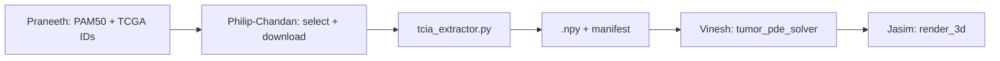

# Philip-Chandan — TCGA/TCIA Radiomics Pipeline Plan

You own **Person 5: Radiomics Pipeline** in this folder. Your job is to get **two real starting tumor volumes** (Luminal A vs Basal) from TCGA-BRCA MRI on TCIA, process them into **clean 3D numpy arrays**, and hand them to **Vinesh** before Day 2 noon. Everything else on the team can proceed with dummy spheres until then.

Philip and Chandan work as **one unit** — same deliverables, same schedule, same code. Pair on everything; split tasks by what's fastest in the moment, not by owner.

---

## Mission & Success Criteria

| Deliverable | Done when |
|-------------|-----------|
| **2 DICOM series downloaded** | One Luminal A + one Basal-like TCGA-BRCA case with usable MRI |
| **`tcia_extractor.py` implemented** | `extract_volume(dicom_dir) → np.ndarray` works on local files |
| **2 processed `.npy` files** | Saved under `data/processed/volumes/` with documented shape/dtype/spacing |
| **`manifest.json`** | Maps subtype → file path → TCGA ID → array metadata |
| **Handoff to Vinesh (Day 2 AM)** | Vinesh loads your arrays into `solve_growth()` without reformatting |

**Out of scope for the 2-day sprint:** full PyRadiomics feature extraction (Phase 2 stretch). Focus on **DICOM → single 3D volume** that Vinesh can simulate.

---

## Your Responsibilities (all of it)

| Area | What you do |
|------|-------------|
| **Discovery & coordination** | Message Praneeth for TCGA barcodes; pick cases; query TCIA; keep backup IDs |
| **Download & QC** | Pull DICOM into `data/raw/tcia/`; visual slice checks; document bad series |
| **Extraction & processing** | Implement `tcia_extractor.py`; stack, normalize, resample, segment, export `.npy` |
| **Manifest & handoff** | Maintain `manifest.json`; deliver arrays to Vinesh; fix integration bugs |

---

## Repository Layout (create on Day 1 AM)

```
breast-cancer-sim/
├── data/                          # gitignored — local only
│   ├── raw/tcia/
│   │   ├── luminal_a/TCGA-XX-XXXX/   # DICOM slices per series
│   │   └── basal/TCGA-YY-YYYY/
│   └── processed/volumes/
│       ├── luminal_a_TCGA-XX-XXXX.npy
│       ├── basal_TCGA-YY-YYYY.npy
│       └── manifest.json
└── simulation-vinesh-philip-chandan/philip-chandan/
    ├── PLAN.md                    # this file
    └── tcia_extractor.py          # main module
```

---

## Day 1 Schedule

### 09:00–10:00 | Kickoff & Infrastructure

1. Clone repo, shared venv:
   ```bash
   cd breast-cancer-sim
   python -m venv .venv && source .venv/bin/activate
   pip install -r requirements.txt
   ```
2. Create `data/raw/tcia/` and `data/processed/volumes/`.
3. Agree on **handoff contract** with Vinesh (see below) — send in Slack before 10:30.
4. Message **Praneeth** for 2 TCGA-BRCA barcodes (Luminal A + Basal).
5. Skim [TCIA TCGA-BRCA collection](https://www.cancerimagingarchive.net/collection/tcga-brca/) and [TCIA REST API docs](https://wiki.cancerimagingarchive.net/display/Public/TCIA+REST+API+Guide).
6. Scaffold `tcia_extractor.py` with `extract_volume`, `save_volume`, `load_manifest`.

### 10:00–12:30 | Download + extractor (interleave as needed)

Work in parallel only when it saves time (e.g. one person kicks off a download while the other codes). Otherwise stay paired on the critical path.

1. **Pick 2 cases** aligned with Praneeth's A/B subtype demo:
   - Luminal A (lower risk)
   - Basal-like (higher risk)
   - Use TCGA clinical + PAM50 from cBioPortal or METABRIC mapping; crosswalk barcode `TCGA-XX-XXXX`.
2. **Query TCIA** for MR series per patient:
   - Collection: `TCGA-BRCA`
   - Prefer **post-contrast T1** or best available 3D-friendly stack
   - TCIA REST example: `getPatient`, `getSeries`, then NBIA or TCIA downloader for DICOM
3. **Download** into `data/raw/tcia/luminal_a/` and `data/raw/tcia/basal/`.
4. **Start first TCIA download by 10:15** — this is the critical path for the whole simulation stack.
5. Implement DICOM → 3D stack with `pydicom` (already in `requirements.txt`):
   - Walk directory, filter by `SOPClassUID` / modality
   - Sort by `InstanceNumber` or `ImagePositionPatient`
   - Build `(Z, Y, X)` float32 array
6. Add **`validate_series(dicom_dir)`** — consistent dimensions, no missing slices.
7. Test `extract_volume()` on the first downloaded folder; if download is slow, use any public TCIA-BRCA sample to unblock.
8. Start **`manifest.json`** with TCGA IDs, series UID, modality, slice count.

**Checkpoint @ 12:00:** At least one DICOM folder on disk + extractor returns a non-empty 3D array.

### 12:30–01:30 | Lunch & Progress Sync

Sync with the team:

| Question for | Why |
|--------------|-----|
| **Praneeth** | Confirmed TCGA IDs for Luminal A vs Basal |
| **Vinesh** | Expected array shape, value range, max size for PDE |
| **Jasim** | Whether volumes need discrete tissue labels (0/1/2) or continuous intensity |

### 01:30–05:00 | Process into simulation-ready volumes

1. **Intensity normalization:** clip outliers, scale to `[0, 1]` (min-max or percentile).
2. **Tumor mask / volume field** (pick one for demo speed):
   - **Fast:** threshold high-intensity voxels → binary mask `{0, 1}`
   - **Better:** simple region growing or Otsu on contrast-enhanced slice
   - Map to tissue semantics Jasim expects: `0 = healthy`, `0.5 = viable`, `1.0 = necrotic` (or let Vinesh assign necrotic during PDE)
3. **Resample** to isotropic spacing (e.g. 1 mm) and **cap size** (e.g. max 128³) so PDE + PyVista stay fast.
4. **Save** `.npy` + update `manifest.json`.
5. Finish second case download if still in progress.
6. Visual QC: middle slice matplotlib check — tumor present, not corrupted.
7. Document any bad series; have **backup case IDs** ready.

**End-of-day target:** Both `.npy` files exist OR one real + one fallback (process a second series from same collection with different subtype label).

---

## Day 2 Schedule

### 09:00–11:30 | Critical handoff (highest priority)

**09:00 — Deliver to Vinesh**

Package:

```
data/processed/volumes/
├── luminal_a_<TCGA-ID>.npy
├── basal_<TCGA-ID>.npy
└── manifest.json
```

**`manifest.json` schema (agree tonight):**

```json
{
  "volumes": [
    {
      "subtype": "Luminal A",
      "tcga_id": "TCGA-XX-XXXX",
      "path": "data/processed/volumes/luminal_a_TCGA-XX-XXXX.npy",
      "shape": [64, 64, 64],
      "dtype": "float32",
      "spacing_mm": [1.0, 1.0, 1.0],
      "value_semantics": {"0": "background/healthy", "1": "tumor/initial burden"},
      "source_series_uid": "..."
    }
  ]
}
```

**Vinesh integration snippet (handoff contract):**

```python
import numpy as np
from pathlib import Path

vol = np.load("data/processed/volumes/luminal_a_TCGA-XX-XXXX.npy")
# vol.shape == (Z, Y, X), dtype float32, values in [0, 1]
frames = solve_growth(vol, timesteps=50, dt=0.1, params={"risk_multiplier": 1.2})
```

Stay on call until Vinesh confirms **`solve_growth(your_array)` runs** without dummy sphere.

**09:30–11:30 — Support**

- Fix shape/dtype/spacing mismatches Vinesh reports.
- If real data fails: provide **deterministic fallback** `.npy` (anatomically plausible blob, not random noise) so demo isn't blocked.
- Verify subtype toggle in UI maps to correct file path.

### 11:30–12:30 | End-to-end wiring

- No new features. Answer Vihari/Jasim questions on loading volumes in Streamlit.
- Optional helper: `load_volume_for_subtype(subtype: str) -> np.ndarray`.

### 01:30–03:30 | Bug squashing (with team)

Your focus:

- Array orientation (Z/Y/X vs X/Y/Z) — #1 rendering bug source.
- Memory: don't load full DICOM in Streamlit; only ship processed `.npy`.
- Speed: ensure downsampling keeps tumor region centered.

### 03:30–05:00 | Code freeze & demo prep

- Freeze `tcia_extractor.py` and `manifest.json`.
- Rehearse: *"We pulled matched TCGA-BRCA MRI from TCIA, processed DICOM into 3D volumes, and fed Vinesh's growth engine for Luminal A vs Basal comparison."*
- Have 2–3 screenshot slices ready if live download fails during demo.

---

## Technical Implementation Guide

### Recommended `tcia_extractor.py` API

```python
def extract_volume(dicom_dir: Path) -> np.ndarray: ...
def normalize_volume(volume: np.ndarray) -> np.ndarray: ...
def segment_tumor(volume: np.ndarray) -> np.ndarray: ...  # optional Day 1 PM
def resample_isotropic(volume: np.ndarray, spacing: tuple, target_spacing: float = 1.0) -> np.ndarray: ...
def save_volume(volume: np.ndarray, out_path: Path, metadata: dict) -> None: ...
def build_manifest(volumes: list[dict], out_path: Path) -> None: ...
```

Use **`scipy.ndimage.zoom`** for resampling (already in requirements).

### TCIA access options

| Method | Use when |
|--------|----------|
| **TCIA REST API** | Discover patients/series programmatically |
| **NBIA Data Retriever** | Bulk DICOM download (GUI or CLI) |
| **Manual TCIA portal** | API blocked or time-critical fallback |

### Case selection strategy

1. Praneeth provides 2 TCGA barcodes with PAM50 labels.
2. Cross-check imaging availability on TCIA (not every TCGA case has MRI).
3. Keep **2 backup cases per subtype** in a spreadsheet.

### Handoff contract (lock with Vinesh Day 1 lunch)

| Property | Recommendation |
|----------|----------------|
| **Shape** | `(Z, Y, X)` — depth first |
| **Dtype** | `float32` |
| **Values** | `[0, 1]` — 0 background, >0 initial tumor burden |
| **Max shape** | ≤ `128×128×128` (64³ if PDE is slow) |
| **Spacing** | Isotropic 1 mm (document in manifest) |
| **Single array** | One volume per case — no multi-channel unless Vinesh asks |

---

## Dependencies & Risks



| Risk | Mitigation |
|------|------------|
| No MRI for chosen TCGA ID | Pre-pick 4 cases; use TCIA search before committing |
| Slow downloads | Start largest download at 10:00; NBIA overnight if needed |
| DICOM series inconsistent | `validate_series()` + skip bad series early |
| Tumor hard to segment | Binary mask from contrast enhancement is enough for demo |
| Arrays too large for browser | Downsample to 64³; document in manifest |
| Subtype mismatch | manifest.json is source of truth; sync with Praneeth |

---

## Phase mapping (2-day sprint vs 4-phase doc)

| 4-phase doc | Your 2-day work |
|-------------|-----------------|
| Phase 1: Data scaffolding | Day 1 AM — env, TCIA query, downloads |
| Phase 2: PyRadiomics | **Defer** unless Day 2 PM is idle |
| Phase 3: Integration | Day 2 AM handoff to Vinesh |
| Phase 4: Polish | Day 2 PM — orientation bugs, demo prep |

---

## Day 1 / Day 2 Checklists

**Day 1 EOD**

- [ ] Venv works; `pydicom` imports
- [ ] ≥1 TCGA-BRCA DICOM series downloaded
- [ ] `extract_volume()` returns 3D array
- [ ] ≥1 `.npy` in `data/processed/volumes/`
- [ ] `manifest.json` drafted
- [ ] Handoff contract agreed with Vinesh

**Day 2 EOD (demo-ready)**

- [ ] Both Luminal A + Basal `.npy` files
- [ ] Vinesh runs full simulation on real data
- [ ] Jasim renders without axis flip
- [ ] Subtype toggle loads correct volume
- [ ] Fallback case documented if live pipeline fails

---

## Immediate next steps (start here)

1. Message Praneeth for 2 TCGA-BRCA barcodes (Luminal A + Basal).
2. Implement `extract_volume()` skeleton + unit test with any DICOM folder.
3. Post handoff contract in team chat before lunch.
4. Start first TCIA download by 10:15 — this is the critical path for the whole simulation stack.
