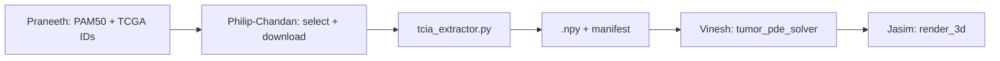
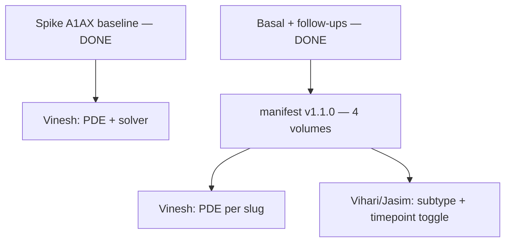

# Philip-Chandan — TCGA/TCIA Radiomics Pipeline Plan

You own **Person 5: Radiomics Pipeline** in this folder. Your job is to get **two real starting tumor volumes** (Luminal A vs Basal) from TCGA-BRCA MRI on TCIA, process them into **clean 3D numpy arrays**, and hand them to **Vinesh** before Day 2 noon. Everything else on the team can proceed with dummy spheres until then.

Philip and Chandan work as **one unit** — same deliverables, same schedule, same code. Pair on everything; split tasks by what's fastest in the moment, not by owner.

---

## Current spike — Option B (active)

**Work from this section first.** The Day 1/Day 2 schedule below is the full sprint; the spike narrows scope to one patient/timepoint with parallel Vinesh ownership of PDE prep.

| Doc | Purpose |
|-----|---------|
| [`../HANDOFF_SPIKE.md`](../HANDOFF_SPIKE.md) | Shared Option B plan (Philip-Chandan + Vinesh) |
| [`../handoff_contract.json`](../handoff_contract.json) | Versioned contract (`1.0.0`) — shape, spacing, solver defaults |
| [`SPIKE_CHECKLIST.md`](SPIKE_CHECKLIST.md) | Your steps 1–4 for the spike |

**Spike case:** `TCGA-AR-A1AX` · Luminal A · baseline `2002-09-12`

**Split:** You deliver **raw** DICOM extract + spacing to `data/processed/raw-extract-philip-chandan/`. Vinesh owns resample/crop/normalize → `data/processed/pde-input-vinesh/` and `solve_growth()`. Do not duplicate his processing in `tcia_extractor.py`.

**Scale-up order:** (1) one baseline spike green → (2) `TCGA-AR-A1AQ` baseline → (3) full two-subtype demo + `manifest.json` → (4) longitudinal follow-ups for both primaries. **Philip-Chandan raw extracts (4 volumes) + manifest v1.1.0 are done.** **Vinesh delivered** all four PDE inputs + manifest in [`../../pde-handoff-vinesh.zip`](../../pde-handoff-vinesh.zip). **Praneeth confirmed** rev2 TCGA IDs. **Jasim** has the zip and is testing render. **Next:** Vihari subtype toggle; Vinesh `solve_growth` verification; Jasim render sign-off.

---

## Mission & Success Criteria

| Deliverable | Done when |
|-------------|-----------|
| **2 DICOM series downloaded** | One Luminal A + one Basal-like TCGA-BRCA case with usable MRI |
| **`tcia_extractor.py` implemented** | `extract_volume(dicom_dir) → np.ndarray` works on local files |
| **Spike raw extract (Option B)** | Raw `.npy` + `.json` in `data/processed/raw-extract-philip-chandan/` for one baseline timepoint |
| **2 PDE-ready volumes (via Vinesh)** | Vinesh writes `data/processed/pde-input-vinesh/` after your raw handoff |
| **`manifest.json`** | Maps subtype → file path → TCGA ID → array metadata (after spike) |
| **Handoff to Vinesh** | `solve_growth()` runs on real data without you reformatting on Vinesh's side |

**Out of scope for the 2-day sprint:** full PyRadiomics feature extraction — that work lives in post-sprint [`stretch/`](stretch/) (see [Post-sprint stretch](#post-sprint-stretch-pyradiomics) below). Sprint focus was **DICOM → single 3D volume** for Vinesh.

---

## Your Responsibilities (all of it)

| Area | What you do |
|------|-------------|
| **Discovery & coordination** | Message Praneeth for TCGA barcodes; pick cases; query TCIA; keep backup IDs |
| **Download & QC** | Pull DICOM into `data/raw/tcia/`; `validate_series`; visual slice checks |
| **Extraction (your scope)** | Raw DICOM → 3D stack via `tcia_extractor.py`; export via `export_raw_extract.py` |
| **PDE prep (Vinesh scope)** | Resample, normalize, segment — `vinesh/prepare_pde_input.py` (see contract) |
| **Manifest & handoff** | `handoff_contract.json` now; full `manifest.json` after spike; fix integration bugs |

---

## Repository Layout (create on Day 1 AM)

```
breast-cancer-sim/
├── data/                          # gitignored — local only
│   ├── raw/tcia/
│   │   └── luminal_a/TCGA-AR-A1AX/
│   │       ├── 2002-09-12/        # spike baseline DICOM
│   │       └── 2003-09-24/        # follow-up (optional until spike green)
│   ├── processed/
│   │   ├── raw-extract-philip-chandan/   # raw .npy + .json per {tcga_id}/{timepoint}
│   │   │   ├── TCGA-AR-A1AX/
│   │   │   │   ├── baseline.{npy,json}
│   │   │   │   └── followup.{npy,json}
│   │   │   └── manifest.json
│   │   ├── pde-input-vinesh/             # Vinesh PDE-ready {tcga_id}/g64/{timepoint}
│   │   └── radiomics-philip-chandan/     # stretch: masks + features CSV (gitignored locally)
│   └── qc/
│       ├── slice-plots-philip-chandan/
│       ├── radiomics-philip-chandan/     # stretch: mask overlay QC PNGs
│       └── solver-runs-vinesh/
└── simulation-vinesh-philip-chandan/
    ├── handoff_contract.json      # versioned Philip-Chandan ↔ Vinesh contract
    ├── HANDOFF_SPIKE.md
    ├── spike_paths.py
    ├── philip-chandan/            # this folder
    │   ├── PLAN.md
    │   ├── SPIKE_CHECKLIST.md
    │   ├── export_raw_extract.py
    │   ├── qc_slice_plot.py
    │   ├── tcia_extractor.py
    │   ├── download_tcia.py
    │   ├── validation/                   # .les ground-truth guide + napari viewer
    │   ├── stretch/                      # post-sprint PyRadiomics (isolated)
    │   └── cohort/
    └── vinesh/
        ├── SPIKE_CHECKLIST.md
        ├── prepare_pde_input.py
        └── tumor_pde_solver.py
```

**Cohort subfolder:** Shared TCGA barcodes for imaging (Philip-Chandan) and genomics (Praneeth) live under `cohort/`. Use `cohort/cohort_discovery.py` to validate or refresh picks before editing `cohort.json`. Extraction and download scripts still import patient IDs via `tcia_extractor.load_cohort()`.

---

## Day 1 Schedule

### 09:00–10:00 | Kickoff & Infrastructure

1. Clone repo, shared venv:
   ```bash
   cd breast-cancer-sim
   python -m venv .venv && source .venv/bin/activate
   pip install -r requirements.txt
   ```
2. Create `data/raw/tcia/` and `data/processed/volumes/`.
3. Agree on **handoff contract** with Vinesh (see below) — send in Slack before 10:30.
4. Message **Praneeth** for 2 TCGA-BRCA barcodes (Luminal A + Basal).
5. Skim [TCIA TCGA-BRCA collection](https://www.cancerimagingarchive.net/collection/tcga-brca/) and [TCIA REST API docs](https://wiki.cancerimagingarchive.net/display/Public/TCIA+REST+API+Guide).
6. Scaffold `tcia_extractor.py` with `extract_volume`, `save_volume`, `load_manifest`.

### 10:00–12:30 | Download + extractor (interleave as needed)

Work in parallel only when it saves time (e.g. one person kicks off a download while the other codes). Otherwise stay paired on the critical path.

1. **Pick 2 cases** aligned with Praneeth's A/B subtype demo:
   - Luminal A (lower risk)
   - Basal-like (higher risk)
   - Use TCGA clinical + PAM50 from cBioPortal or METABRIC mapping; crosswalk barcode `TCGA-XX-XXXX`.
2. **Query TCIA** for MR series per patient:
   - Collection: `TCGA-BRCA`
   - Prefer **post-contrast T1** or best available 3D-friendly stack
   - TCIA REST example: `getPatient`, `getSeries`, then NBIA or TCIA downloader for DICOM
3. **Download** into `data/raw/tcia/luminal_a/` and `data/raw/tcia/basal/`.
4. **Start first TCIA download by 10:15** — this is the critical path for the whole simulation stack.
5. Implement DICOM → 3D stack with `pydicom` (already in `requirements.txt`):
   - Walk directory, filter by `SOPClassUID` / modality
   - Sort by `InstanceNumber` or `ImagePositionPatient`
   - Build `(Z, Y, X)` float32 array
6. Add **`validate_series(dicom_dir)`** — consistent dimensions, no missing slices.
7. Test `extract_volume()` on the first downloaded folder; if download is slow, use any public TCIA-BRCA sample to unblock.
8. Start **`manifest.json`** with TCGA IDs, series UID, modality, slice count.

**Checkpoint @ 12:00:** At least one DICOM folder on disk + extractor returns a non-empty 3D array.

### 12:30–01:30 | Lunch & Progress Sync

Sync with the team:

| Question for | Why |
|--------------|-----|
| **Praneeth** | Confirmed TCGA IDs for Luminal A vs Basal |
| **Vinesh** | Expected array shape, value range, max size for PDE |
| **Jasim** | Whether volumes need discrete tissue labels (0/1/2) or continuous intensity |

### 01:30–05:00 | Process into simulation-ready volumes

1. **Intensity normalization:** clip outliers, scale to `[0, 1]` (min-max or percentile).
2. **Tumor mask / volume field** (pick one for demo speed):
   - **Fast:** threshold high-intensity voxels → binary mask `{0, 1}`
   - **Better:** simple region growing or Otsu on contrast-enhanced slice
   - Map to tissue semantics Jasim expects: `0 = healthy`, `0.5 = viable`, `1.0 = necrotic` (or let Vinesh assign necrotic during PDE)
3. **Resample** to isotropic spacing (e.g. 1 mm) and **cap size** (e.g. max 128³) so PDE + PyVista stay fast.
4. **Save** `.npy` + update `manifest.json`.
5. Finish second case download if still in progress.
6. Visual QC: middle slice matplotlib check — tumor present, not corrupted.
7. Document any bad series; have **backup case IDs** ready.

**End-of-day target:** Both `.npy` files exist OR one real + one fallback (process a second series from same collection with different subtype label).

---

## Day 2 Schedule

### 09:00–11:30 | Critical handoff (highest priority)

**09:00 — Deliver to Vinesh**

Package:

```
data/processed/volumes/
├── luminal_a_<TCGA-ID>.npy
├── basal_<TCGA-ID>.npy
└── manifest.json
```

**`manifest.json` schema (agree tonight):**

```json
{
  "volumes": [
    {
      "subtype": "Luminal A",
      "tcga_id": "TCGA-XX-XXXX",
      "path": "data/processed/volumes/luminal_a_TCGA-XX-XXXX.npy",
      "shape": [64, 64, 64],
      "dtype": "float32",
      "spacing_mm": [1.0, 1.0, 1.0],
      "value_semantics": {"0": "background/healthy", "1": "tumor/initial burden"},
      "source_series_uid": "..."
    }
  ]
}
```

**Vinesh integration snippet (handoff contract):**

```python
import numpy as np
from pathlib import Path

vol = np.load("data/processed/volumes/luminal_a_TCGA-XX-XXXX.npy")
# vol.shape == (Z, Y, X), dtype float32, values in [0, 1]
frames = solve_growth(vol, timesteps=50, dt=0.1, params={"risk_multiplier": 1.2})
```

Stay on call until Vinesh confirms **`solve_growth(your_array)` runs** without dummy sphere.

**09:30–11:30 — Support**

- Fix shape/dtype/spacing mismatches Vinesh reports.
- If real data fails: provide **deterministic fallback** `.npy` (anatomically plausible blob, not random noise) so demo isn't blocked.
- Verify subtype toggle in UI maps to correct file path.

### 11:30–12:30 | End-to-end wiring

- No new features. Answer Vihari/Jasim questions on loading volumes in Streamlit.
- Optional helper: `load_volume_for_subtype(subtype: str) -> np.ndarray`.

### 01:30–03:30 | Bug squashing (with team)

Your focus:

- Array orientation (Z/Y/X vs X/Y/Z) — #1 rendering bug source.
- Memory: don't load full DICOM in Streamlit; only ship processed `.npy`.
- Speed: ensure downsampling keeps tumor region centered.

### 03:30–05:00 | Code freeze & demo prep

- Freeze `tcia_extractor.py` and `manifest.json`.
- Rehearse: *"We pulled matched TCGA-BRCA MRI from TCIA, processed DICOM into 3D volumes, and fed Vinesh's growth engine for Luminal A vs Basal comparison."*
- Have 2–3 screenshot slices ready if live download fails during demo.

---

## Technical Implementation Guide

### Recommended `tcia_extractor.py` API

```python
def extract_volume(dicom_dir: Path) -> np.ndarray: ...
def normalize_volume(volume: np.ndarray) -> np.ndarray: ...
def segment_tumor(volume: np.ndarray) -> np.ndarray: ...  # optional Day 1 PM
def resample_isotropic(volume: np.ndarray, spacing: tuple, target_spacing: float = 1.0) -> np.ndarray: ...
def save_volume(volume: np.ndarray, out_path: Path, metadata: dict) -> None: ...
def build_manifest(volumes: list[dict], out_path: Path) -> None: ...
```

Use **`scipy.ndimage.zoom`** for resampling (already in requirements).

### TCIA access options

| Method | Use when |
|--------|----------|
| **TCIA REST API** | Discover patients/series programmatically |
| **NBIA Data Retriever** | Bulk DICOM download (GUI or CLI) |
| **Manual TCIA portal** | API blocked or time-critical fallback |

### Library migration — status

Philip-Chandan **phases 1–2 are done** (downloads + extraction). Public APIs unchanged; `tests/test_tcia_extractor.py` passes (25 tests, including regression against saved raw exports).

#### Transition order

| Phase | Status | Action |
|-------|--------|--------|
| **0 — Spike bootstrap** | **done** | [`../download_spike_data.ps1`](../download_spike_data.ps1) / [`.sh`](../download_spike_data.sh) for one-patient handoff |
| **1 — Scale-up downloads** | **done** | `download_tcia.py` uses **idc-index** (`IDCClient`) primary; **tcia-utils** NBIA fallback |
| **2 — Extraction hardening** | **done** | `tcia_extractor.py` loads volumes via **SimpleITK** `ImageSeriesReader`; pydicom kept for validation metadata |
| **3 — Phase 2 stretch** | **done** | [`stretch/`](stretch/) — prep, PyRadiomics + fastrad extraction, batch CSV, tests ([`STRETCH_PLAN.md`](stretch/STRETCH_PLAN.md)) |

#### What to keep vs replace

| Area | Implementation | Status | Notes |
|------|----------------|--------|-------|
| **Spike data bootstrap** | `download_spike_data.py` / `.ps1` / `.sh` | **Keep** | Thin wrappers; call shared Python |
| **Raw export handoff** | `export_raw_extract.py` | **Keep** | Contract JSON, slug paths, `contract_version` |
| **Slice QC plot** | `qc_slice_plot.py` + matplotlib | **Keep** | Enough for sign-off; napari optional |
| **TCIA download** | `download_tcia.py` + idc-index + tcia-utils | **done** | NBIA Data Retriever CLI still valid fallback |
| **DICOM → 3D + validate** | SimpleITK read + pydicom validate | **done** | highdicom / dicom-numpy in `requirements.txt` but unused — only if ITK gaps appear |
| **Base DICOM I/O** | pydicom | **Keep** | Used for slice metadata and validation checks |
| **PDE resample/crop** (Vinesh) | `scipy.ndimage.zoom` in `prepare_pde_input.py` | **unchanged** | SimpleITK `Resample` only if Vinesh hits axis/spacing bugs |
| **Radiomics (Phase 2 stretch)** | PyRadiomics + optional `fastrad` in [`stretch/`](stretch/) | **done** | Canonical handoff: PyRadiomics CSV; fastrad for parity/speed; see [`validation/VALIDATION.md`](validation/VALIDATION.md) for `.les` ground truth |

#### Migration rules (still apply for future changes)

1. **Preserve the handoff contract** — `(Z, Y, X)` float32 raw extract, `spacing_mm` in sidecar JSON; bump [`../handoff_contract.json`](../handoff_contract.json) `version` if outputs change.
2. **Swap internals, not filenames** — keep `validate_series()`, `extract_volume()`, `extract_volume_with_spacing()` signatures; tests must still pass.
3. **Tell Vinesh** if raw extract shape/spacing or download layout changes.

#### Current implementation (reference)

```python
# download_tcia.py — idc-index primary
from idc_index import IDCClient
client = IDCClient()

# tcia_extractor.py — SimpleITK read
import SimpleITK as sitk
reader = sitk.ImageSeriesReader()
reader.SetFileNames(sitk.ImageSeriesReader.GetGDCMSeriesFileNames(str(dicom_dir)))
volume = sitk.GetArrayFromImage(reader.Execute()).astype(np.float32)  # (Z, Y, X)
```


1. Praneeth provides 2 TCGA barcodes with PAM50 labels.
2. Cross-check imaging availability on TCIA (not every TCGA case has MRI).
3. Keep **2 backup cases per subtype** in a spreadsheet.

### Handoff contract

**Locked in** [`../handoff_contract.json`](../handoff_contract.json) (`version` **1.0.0**). Bump `"version"` when shape/spacing/solver defaults change; both sides pull before re-running export or `prepare_pde_input`.

| Property | Agreed value |
|----------|----------------|
| **Raw extract (you)** | `(Z, Y, X)` float32, not normalized; spacing in sidecar JSON |
| **PDE input (Vinesh)** | max `[64, 64, 64]`, spacing `[1, 1, 1]` mm, values `[0, 1]`, tumor **> 0** |
| **Solver defaults** | `timesteps=50`, `dt=0.1`, `risk_multiplier=1.2` |

Legacy Day 2 `manifest.json` schema below still applies when scaling to two subtypes after the spike.

---

## Dependencies & Risks



| Risk | Mitigation |
|------|------------|
| No MRI for chosen TCGA ID | Pre-pick 4 cases; use TCIA search before committing |
| Slow downloads | Start largest download at 10:00; NBIA overnight if needed |
| DICOM series inconsistent | `validate_series()` + skip bad series early |
| Tumor hard to segment | Binary mask from contrast enhancement is enough for demo |
| Arrays too large for browser | Downsample to 64³; document in manifest |
| Subtype mismatch | manifest.json is source of truth; sync with Praneeth |

---

## Phase mapping (2-day sprint vs 4-phase doc)

| 4-phase doc | Your 2-day work |
|-------------|-----------------|
| Phase 1: Data scaffolding | Day 1 AM — env, TCIA query, downloads |
| Phase 2: PyRadiomics | **done (post-sprint)** — [`stretch/STRETCH_PLAN.md`](stretch/STRETCH_PLAN.md); Praneeth CSV handoff pending |
| Phase 3: Integration | Day 2 AM handoff to Vinesh |
| Phase 4: Polish | Day 2 PM — orientation bugs, demo prep |

---

## Day 1 / Day 2 Checklists

**Spike (Option B — do first)**

- [x] Cohort rev2 locked; `handoff_contract.json` agreed with Vinesh
- [x] `tcia_extractor.py` + unit tests (SimpleITK extraction; idc-index downloads)
- [x] Spike baseline DICOM on disk (`TCGA-AR-A1AX` / `2002-09-12`)
- [x] `validate_series` passes on spike folder
- [x] Raw extract exported to `raw-extract-philip-chandan/`
- [x] Slice QC PNG saved
- [x] Vinesh PDE inputs delivered — [`../../pde-handoff-vinesh.zip`](../../pde-handoff-vinesh.zip) (4 slugs + manifest)
- [ ] Vinesh `solve_growth()` verified end-to-end on real PDE input

**Day 1 EOD (full sprint)**

- [x] Venv works; `pydicom` imports
- [x] ≥1 TCGA-BRCA DICOM series downloaded
- [x] `extract_volume()` returns 3D array on real data
- [x] Spike raw handoff complete (see above)
- [x] `manifest.json` drafted — **v1.1.0**, four volumes (2 patients × baseline + follow-up)
- [x] Handoff contract agreed with Vinesh

**Day 2 EOD (demo-ready)**

- [x] Both Luminal A + Basal raw `.npy` files (baselines + follow-ups exported)
- [x] Vinesh PDE input per slug (in `pde-handoff-vinesh.zip`)
- [ ] Vinesh full simulation on real data (`solve_growth` per slug)
- [ ] Jasim renders without axis flip — **in progress** (zip shared; testing)
- [ ] Subtype toggle loads correct volume
- [ ] Fallback case documented if live pipeline fails

---

## Immediate next steps (start here)

**Philip-Chandan imaging pipeline is complete** for rev2 primaries (4 raw extracts + QC + manifest). **Vinesh delivered** [`../../pde-handoff-vinesh.zip`](../../pde-handoff-vinesh.zip). **Praneeth aligned** on rev2 IDs. **Jasim** has the zip and is testing render.

**Philip-Chandan next:** Vihari handoff + demo prep while Jasim tests (stand by for render triage).

1. ~~**Ping Vinesh**~~ — **done** — zip contains all slugs + manifest.
2. ~~**Sync Praneeth**~~ — **done** — confirmed rev2 barcodes for GDC/genomics.
3. ~~**Tell Jasim**~~ — **done** — zip shared; render test **in progress**.
4. **Tell Vihari** — `manifest.json` maps subtype + timepoint → `slug` → `pde_npy` (in zip at `data/processed/raw-extract-philip-chandan/manifest.json`).

**Useful while waiting (not blocking):**

- Document **fallback case** in PLAN or Slack if live pipeline fails at demo (deterministic blob `.npy` path or dummy-sphere note).
- Keep **QC slice PNGs** handy for demo (`data/qc/slice-plots-philip-chandan/`).
- Optional: `load_volume_for_subtype(subtype, timepoint)` helper in `philip-chandan/` if Vihari wants a one-liner to resolve manifest paths (coordinate first).

Optional code cleanup (not blocking): PyRadiomics stretch — see [`stretch/STRETCH_PLAN.md`](stretch/STRETCH_PLAN.md) and [Known issue — Luminal A follow-up](#known-issue--luminal-a-follow-up-stretch-blocked) below (basal CSV in progress; Luminal A blocked on mask fix).

---

## Post-sprint: stretch (PyRadiomics)

Isolated pipeline under [`stretch/`](stretch/). Does **not** modify sprint handoff (`tcia_extractor.py`, `vinesh/`). Reads raw extracts only; writes to `data/processed/radiomics-philip-chandan/` and `data/qc/radiomics-philip-chandan/`.

**Breast tumor segmentation:** automated lesion segmentation benchmark (Otsu, nnU-Net, vs `.les` ground truth) — [`segmentation/PLAN.md`](segmentation/PLAN.md).

### Status

| Phase | Item | Status |
|-------|------|--------|
| 1 | Scaffold (`paths`, `load_manifest`, docs) | **done** |
| 2 | `prep_volume.py` — percentile norm, Otsu mask, SITK | **done** |
| 2b | `qc_mask_overlay.py` | **done** — 4 slugs on disk |
| 3 | `extract_radiomics.py` | **done** — PyRadiomics default + optional `fastrad` backend |
| 4 | `run_all_radiomics.py`, `compare_longitudinal.py` | **partial** — basal slugs only; Luminal A deferred (see Known issue) |
| 5 | `PRANEETH_HANDOFF.md`, CSV to Praneeth | **pending** (basal CSV first) |
| 6 | `stretch/tests/` | **done** (10 tests: prep + dual-backend parity) |

### Libraries

| Role | Package | Notes |
|------|---------|-------|
| Canonical features | **PyRadiomics** | [`radiomics_params.yaml`](stretch/radiomics_params.yaml) — firstorder, shape, glcm; `normalize: false` (prep scales to [0,1]) |
| Optional fast backend | **fastrad** | `--backend fastrad --device cpu` (Mac); NVIDIA users can opt into `fastrad[cuda]` separately — not in default `requirements.txt` |
| Mask (heuristic) | skimage Otsu + scipy CC | Mirrors [`vinesh/calibrate.py`](../vinesh/calibrate.py); not radiologist ground truth |

### Validation (`.les` ground truth — done)

[`validation/VALIDATION.md`](validation/VALIDATION.md) — TCIA radiologist `.les` masks downloaded; [`stretch/load_les_mask.py`](stretch/load_les_mask.py) + [`stretch/validate_segmentation.py`](stretch/validate_segmentation.py) compare Otsu vs expert (Dice **0** on rev2 baselines; Otsu captures orders of magnitude more tissue). 3D inspection: [`validation/view_les_napari.py`](validation/view_les_napari.py) (`--phases-only` for P1–P4 grid; `--cuboid-enhancement` for automated overlay). See [`PIPELINE_REPORT.pdf`](PIPELINE_REPORT.pdf) Section 7 / Figure 6.

#### TCIA `.les` files — what they provide

The `.les` file is TCIA’s **radiologist tumor annotation** for a baseline DCE study ([TCGA-Breast-Radiogenomics segmented lesions](https://www.cancerimagingarchive.net/analysis-result/tcga-breast-radiogenomics/)). **We do not generate it** — it is expert ground truth from UChicago.

**Clinical origin (not a hand-traced contour):** Per [Li et al., npj Breast Cancer 2016](https://www.nature.com/articles/npjbcancer201612), radiologists clicked an approximate **tumor center** on ClearCanvas; a **consensus center** fed **fuzzy c-means (FCM)** 3D segmentation (Chicago Dynamic MRI Explorer / UChicago V2010). The file stores FCM-positive voxels inside a bounding cuboid only.

**Binary on-disk format** (parsed by [`stretch/load_les_mask.py`](stretch/load_les_mask.py)):

| Part | Contents |
|------|----------|
| Header (12 bytes) | Six `uint16` bounds: `y_start, x_start, z_start, y_end, x_end, z_end` in MR index space |
| Payload | `int8` voxels (0 = background, 1 = lesion), row-major **(Y, X, Z)** inside that box |
| Embedded mask | Transposed and pasted into dense **`(Z, Y, X)`** matching the annotated VIBRANT stack |

**Naming:** `TCGA-XX-XXXX-Sn-m.les` — `n` = DCE sequence index (rev2 baselines use **S2 = VIBRANT**), `m` = lesion index.

**Metadata from the loader:** `patient_id`, `dce_index`, `lesion_index`, cuboid bounds, `lesion_voxels` / `mask_voxels` (~**1.3k–2.7k** for rev2 primaries). Rev2 cuboids are only ~**31–34%** filled — the rest is padding. In napari this reads as sparse “dots”, especially when viewing **phases 2–4** while the FCM cluster sits at **phase-1 z**.

**What we use `.les` for in this repo:**

| Use | Module |
|-----|--------|
| Segmentation validation (Dice / volume vs Otsu) | [`stretch/validate_segmentation.py`](stretch/validate_segmentation.py) |
| 3D QC viewer (expert overlay, optional cuboid shell via `--cuboid`) | [`validation/view_les_napari.py`](validation/view_les_napari.py) |
| P1 z-band alignment + bbox threshold workflow | [`validation/run_aligned_bbox_workflow.py`](validation/run_aligned_bbox_workflow.py) |
| Radiomics ROI (planned — `cohort.json` `"use_les_mask": true`) | [`stretch/prep_volume.py`](stretch/prep_volume.py) |
| Automated segmentation prior (`cuboid_enhancement` uses **bounds + Y/X footprint**, not FCM voxels as input) | [`segmentation/methods/cuboid_enhancement.py`](segmentation/methods/cuboid_enhancement.py) |

**What `.les` does *not* provide:**

- No follow-up annotations (rev2 follow-ups have **no** `.les`)
- Not on every TCIA patient (~48 BRCA MRI cases lack `.les`)
- Not intensity values — binary mask + bounding box only
- Not phase-separated — z indices refer to the **full stacked VIBRANT volume**, not individual DCE phases

**One-line summary:** `.les` gives **expert tumor location and sparse FCM shape** (mask + cuboid) on the annotated DCE series, for baseline cases with TCIA annotations.

**Automated alternative under test:** [`segmentation/methods/cuboid_enhancement.py`](segmentation/methods/cuboid_enhancement.py) — cuboid spatial prior + local enhancement on phases 2–4; see [`segmentation/PLAN.md`](segmentation/PLAN.md).

#### Aligned bbox workflow → tumor mask volume

For baseline cases with `.les`, we build a **motion-corrected tumor mask** by aligning DCE phases inside the expert z-band, then thresholding inside the tight bounding box.

**Geometry (two ROIs):**

| Step | ROI | Shape intent |
|------|-----|----------------|
| Registration | P1 `.les` local z-band, **full in-plane Y/X** | Same slab grid for **P1–P3** after rigid align (late DCE tail P4+ skipped) |
| Metrics + mask | Same z-band, **tight `.les` Y/X bbox** | Center-connected curves and final mask on **P2–P3** |

P1 anchors local z (e.g. 19–26 on A1AX, 78–84 on A1AQ); P2–P3 use the same slice indices even though expert FCM voxels only exist on P1. Series with >4 DCE groups (e.g. A1AQ P4/P5) are truncated to **`ALIGNED_BBOX_REGISTRATION_PHASES = (1, 2, 3)`** before align/napari/plots.

**Pipeline:**

```
load VIBRANT + .les
  → keep P1–P3 only (skip late DCE phases)
  → extract P1 z-band slab (full Y/X) per phase
  → rigid register P2–P3 slabs → P1 grid
  → inside .les bbox on aligned P2–P3 slabs: center-connected fraction vs threshold
  → elbow on connected curve (not raw bright fraction); optional gap stub (0–10 voxels)
  → embed singly-connected center region in full `(Z,Y,X)` stack at global .les indices
  → optional: 2D hole-fill necrotic core in `.les` cuboid (rim-enhancing lesions)
```

**Optional manual QC:** `napari-segment-blobs-and-things-with-membranes` (in `requirements.txt`, replace later) adds **Tools → Segmentation** threshold/CC/watershed on a single layer — use on a cropped phase slab if you want to compare with our dock.

```bash
# Napari QC — aligned z-band slabs + bbox threshold slider + export
.venv/bin/python simulation-vinesh-philip-chandan/philip-chandan/validation/view_aligned_cuboid_napari.py \
  --slug luminal_a_TCGA-AR-A1AX_baseline --show-postcontrast-bright

# Sequential queue — skips slugs already exported (checkpoint JSON)
.venv/bin/python simulation-vinesh-philip-chandan/philip-chandan/validation/run_aligned_bbox_napari_queue.py
.venv/bin/python simulation-vinesh-philip-chandan/philip-chandan/validation/run_aligned_bbox_napari_queue.py --status
```

Right dock: **P2/P3 only** (P4+ excluded from align + plots). Center-connected region from bbox center; **Connectivity gap** stub (0=strict). **Jump to elbow** on connected curve. **Export mask → .npy** writes full-stack mask locally. P1 shows selected-phase mask; optional red overlay on P2–P3.

```bash
# Full workflow: align → threshold curves PNG → aligned_bbox_tumor mask (.npy local)
.venv/bin/python simulation-vinesh-philip-chandan/philip-chandan/validation/run_aligned_bbox_workflow.py \
  --slug luminal_a_TCGA-AR-A1AX_baseline

# Plot/table only (no mask write)
.venv/bin/python simulation-vinesh-philip-chandan/philip-chandan/validation/run_aligned_bbox_workflow.py \
  --slug luminal_a_TCGA-AR-A1AX_baseline --no-mask

# Rim enhancement: fill necrotic core inside exported mask (.npy local; updates JSON sidecar)
.venv/bin/python simulation-vinesh-philip-chandan/philip-chandan/validation/fill_necrotic_core.py \
  --slug basal_TCGA-AR-A1AQ_baseline
```

**Outputs** (git: PNG + JSON only; `.npy` stays local):

| Artifact | Path |
|----------|------|
| Threshold curve PNG | `data/qc/segmentation-philip-chandan/{slug}_aligned_bbox_bright_vs_threshold.png` |
| Tumor mask volume | `data/processed/segmentation-philip-chandan/{slug}_aligned_bbox_tumor_mask.npy` |
| Mask sidecar | `data/processed/segmentation-philip-chandan/{slug}_aligned_bbox_tumor_mask.json` |
| Export queue log | `data/processed/segmentation-philip-chandan/.aligned_bbox_napari.state.json` |

**Modules:** [`validation/cuboid_phase_registration.py`](validation/cuboid_phase_registration.py), [`validation/les_cuboid_brightness.py`](validation/les_cuboid_brightness.py), [`validation/aligned_bbox_tumor.py`](validation/aligned_bbox_tumor.py), [`validation/run_aligned_bbox_workflow.py`](validation/run_aligned_bbox_workflow.py), [`validation/run_aligned_bbox_napari_queue.py`](validation/run_aligned_bbox_napari_queue.py), [`validation/fill_necrotic_core.py`](validation/fill_necrotic_core.py).

**Status (rev2 baselines):** Both primaries have aligned-bbox mask JSON + QC PNGs in git; **`.npy` volumes stay local**.

| Slug | Phase @ thresh | Bbox voxels | Notes |
|------|----------------|-------------|-------|
| `luminal_a_TCGA-AR-A1AX_baseline` | P2 @ 0.35 | ~1.8k | Center-connected; napari export |
| `basal_TCGA-AR-A1AQ_baseline` | P2 @ 0.412 | ~4.7k | Rim lesion; **+387** voxels from 2D necrotic-core fill |

**Next:** wire aligned masks into stretch `prep_volume.py` for radiomics; Vinesh handoff if PDE needs binary ROI.

Pre-alignment cuboid curves (no registration) remain in [`validation/view_les_napari.py`](validation/view_les_napari.py) brightness dock and [`validation/plot_les_cuboid_histograms.py`](validation/plot_les_cuboid_histograms.py).

### Known issue — Luminal A follow-up (stretch blocked)

**Do not run full `run_all_radiomics.py` until fixed.** Batch extraction hung for 20+ minutes on the first slug because PyRadiomics is CPU-bound on large cropped volumes.

| Slug | Raw shape | Cropped mask shape | Masked voxels | Notes |
|------|-----------|-------------------|---------------|-------|
| `luminal_a_TCGA-AR-A1AX_baseline` | 352×256×256 | 277×256×212 | ~3.5M | Slow but feasible |
| **`luminal_a_TCGA-AR-A1AX_followup`** | **552×512×512** | **552×367×512** | **~18.3M** | **Root cause** — Otsu + largest-CC mask spans nearly full FOV; PyRadiomics runtime explodes |

**Symptoms:** `run_all_radiomics.py` at 100% CPU with no `features_all.csv` for extended periods.

**Workaround (current):** Skip Luminal A stretch; run basal slugs only:
```bash
cd breast-cancer-sim
.venv/bin/python simulation-vinesh-philip-chandan/philip-chandan/stretch/extract_radiomics.py --slug basal_TCGA-AR-A1AQ_baseline
.venv/bin/python simulation-vinesh-philip-chandan/philip-chandan/stretch/extract_radiomics.py --slug basal_TCGA-AR-A1AQ_followup
# Or: run_all_radiomics.py --slug basal_TCGA-AR-A1AQ_baseline --slug basal_TCGA-AR-A1AQ_followup
```

**Fix needed (pick one or combine):**
1. Tighten tumor isolation in `stretch/prep_volume.py` (Otsu threshold / connected-component logic) so follow-up ROI is tumor-sized, not breast-sized.
2. Wire TCIA radiologist `.les` masks (`cohort.json` has `"use_les_mask": true` — loader not implemented; see [`validation/VALIDATION.md`](validation/VALIDATION.md)).
3. Cap crop bbox max extent or resample to isotropic spacing before PyRadiomics (document if chosen — affects feature comparability).

Sprint handoff (raw extracts + Vinesh PDE inputs) is **unaffected** — this issue is stretch-only.

### Stretch next steps (Philip-Chandan)

1. Review mask QC overlays in `data/qc/radiomics-philip-chandan/` — **basal OK**; **re-check Luminal A follow-up** after fix.
2. Run basal batch extraction (Luminal A deferred until mask fix):
   ```bash
   cd breast-cancer-sim
   .venv/bin/python simulation-vinesh-philip-chandan/philip-chandan/stretch/run_all_radiomics.py \
     --slug basal_TCGA-AR-A1AQ_baseline --slug basal_TCGA-AR-A1AQ_followup
   .venv/bin/python simulation-vinesh-philip-chandan/philip-chandan/stretch/compare_longitudinal.py
   ```
3. Write `stretch/PRANEETH_HANDOFF.md` and share basal `features_all.csv` (join on `tcga_id`; Luminal A rows TBD).

---

## Scale-up plan (downstream integration)

Philip-Chandan raw pipeline for rev2 primaries is **complete**. Vinesh delivered PDE inputs in [`../../pde-handoff-vinesh.zip`](../../pde-handoff-vinesh.zip).

### End state (demo-ready)

| Milestone | Patients | Timepoints | Raw extracts | Philip-Chandan | Downstream |
|-----------|----------|------------|--------------|----------------|------------|
| **Spike** | 1 · Luminal A | baseline | 1 | **done** | Vinesh: PDE input **done** (in zip) |
| **Two-subtype demo** | 2 · LumA + Basal | baseline each | 2 | **done** | Vinesh: 2 PDE inputs **done**; UI subtype toggle pending |
| **Longitudinal** | 2 | baseline + follow-up | 4 | **done** | Vinesh: 4 PDE inputs **done**; Jasim render **in progress** |
| **Radiomics (stretch)** | 2 | baseline + follow-up | 4 | sprint **done**; stretch **basal only** (2 slugs → CSV); Luminal A **blocked** — mask fix | Praneeth: basal CSV first; LumA after fix |

Primary cohort (rev2) in [`cohort/cohort.json`](cohort/cohort.json):

| Subtype | TCGA ID | Baseline study | Follow-up (optional) |
|---------|---------|----------------|----------------------|
| Luminal A | `TCGA-AR-A1AX` | `2002-09-12` | `2003-09-24` |
| Basal-like | `TCGA-AR-A1AQ` | `2001-11-21` | `2003-05-07` |

### Slug naming (lock before batch export)

One raw extract per **patient × timepoint**:

```
{subtype_slug}_{tcga_id}_{timepoint_label}
```

Examples:

| Slug | Status | Shape | Spacing (mm) |
|------|--------|-------|--------------|
| `luminal_a_TCGA-AR-A1AX_baseline` | **done** | `[352, 256, 256]` | `[3.0, 0.8594, 0.8594]` |
| `basal_TCGA-AR-A1AQ_baseline` | **done** | `[464, 256, 256]` | `[3.0, 0.859375, 0.859375]` |
| `luminal_a_TCGA-AR-A1AX_followup` | **done** | `[552, 512, 512]` | `[2.2, 0.5273, 0.5273]` |
| `basal_TCGA-AR-A1AQ_followup` | **done** | `[448, 256, 256]` | `[3.0, 0.9375, 0.9375]` |

Output paths (patient-nested volumes; slugs unchanged for CLI/QC/segmentation):

```
data/processed/raw-extract-philip-chandan/{tcga_id}/{timepoint}.npy
data/processed/raw-extract-philip-chandan/{tcga_id}/{timepoint}.json
data/processed/pde-input-vinesh/{tcga_id}/g64/{timepoint}.npy
data/qc/slice-plots-philip-chandan/{slug}_mid-z.png
```

Regenerate manifest after export: `python philip-chandan/generate_manifest.py`. One-time migration from flat slug files: `python philip-chandan/migrate_patient_volume_layout.py`.

### Scale-up tasks (Philip-Chandan)

| # | Task | Status |
|---|------|--------|
| 1 | **Ping Vinesh** | **done** — [`../../pde-handoff-vinesh.zip`](../../pde-handoff-vinesh.zip) delivered |
| 2 | **Download Basal baseline** | **done** — DICOM on disk |
| 3 | **Validate Basal series** | **done** |
| 4 | **Export Basal raw extract** | **done** — `basal_TCGA-AR-A1AQ_baseline` |
| 5 | **QC plot Basal** | **done** |
| 6 | **`manifest.json`** | **done** — v1.2.0, four volumes + `patients[]` index |
| 7 | **Follow-up LumA** | **done** — `2003-09-24`, slug `..._followup` |
| 8 | **Follow-up Basal** | **done** — `2003-05-07` |
| 9 | **Sync Praneeth** | **done** — confirmed rev2 IDs (`TCGA-AR-A1AX`, `TCGA-AR-A1AQ`) |
| 10 | **Hand off Jasim** | **in progress** — zip shared; render test underway |

**Out of scope for you:** `prepare_pde_input`, `solve_growth`, resample/normalize — Vinesh owns per slug.

### Suggested order (parallel to Vinesh)



**Next:** Jasim render sign-off + Vihari subtype toggle (PDE inputs in zip; solver frames from Vinesh).

### Jasim handoff workflow

1. ~~**Share data**~~ — **done** — [`../../pde-handoff-vinesh.zip`](../../pde-handoff-vinesh.zip) shared with Jasim.
2. **Manifest** — `data/processed/raw-extract-philip-chandan/manifest.json` (v1.2.0): `patients[]` + per-volume `slug`, nested `raw_npy` / `pde_npy`, `shape`, `spacing_mm`.
3. **Static render test** — load `pde_npy` (64³ float32, `[0,1]`, tumor `> 0`); axis **(Z, Y, X)** per [`../handoff_contract.json`](../handoff_contract.json).
4. **Animation** — Vinesh runs `solve_growth()` → `list[np.ndarray]` of frames; contract in [`../vinesh/INTERFACE.md`](../vinesh/INTERFACE.md) (continuous density, not label map).
5. **Verify** — Jasim confirms no axis flip; isosurface at ~0.5 looks like a tumor blob. **Status: testing.**
6. **You on standby** — if render looks wrong, check whether Jasim loaded `raw_npy` (wrong — huge MR intensities) vs `pde_npy` / solver frames.

### Batch export — `export_all_raw.py`

Loops `cohort.json` and calls `export_raw_extract()` + QC plot per slug. Patient and timepoint scope mirror `download_tcia.py`. Progress is checkpointed to `data/processed/raw-extract-philip-chandan/.export_all_raw.state.json` (resume by default; one slug flushed at a time with per-job timing).

```bash
# All primary patients, every timepoint (default; resumes if interrupted)
python simulation-vinesh-philip-chandan/philip-chandan/export_all_raw.py --all-primary

# Baselines only
python simulation-vinesh-philip-chandan/philip-chandan/export_all_raw.py --all-primary --timepoints baseline

# One patient, follow-up only
python simulation-vinesh-philip-chandan/philip-chandan/export_all_raw.py \
  --tcga-id TCGA-AR-A1AX --subtype "Luminal A" --timepoints followup

# Skip QC PNGs for a faster re-export
python simulation-vinesh-philip-chandan/philip-chandan/export_all_raw.py --all-primary --no-qc

# Clean restart (delete checkpoint)
python simulation-vinesh-philip-chandan/philip-chandan/export_all_raw.py --all-primary --fresh

# Monitor a long run (another terminal)
jq '{status: .run_status, current: .current_job_id, summary: .summary}' \
  data/processed/raw-extract-philip-chandan/.export_all_raw.state.json
```

`--timepoints` accepts `all` (default), a single label (`baseline`, `followup`), or comma-separated labels. Backups without `study_date` in cohort are skipped with a message. Also: `--resume` / `--no-resume`, `--force`, `--retry-failed`, `--status-file PATH`.

### `manifest.json` schema (Philip-Chandan source of truth)

Write to `data/processed/raw-extract-philip-chandan/manifest.json` (or `data/processed/manifest.json` if Vihari prefers repo-relative paths):

```json
{
  "version": "1.2.0",
  "contract_version": "1.0.0",
  "patients": [
    {
      "tcga_id": "TCGA-AR-A1AX",
      "subtype": "Luminal A",
      "baseline_slug": "luminal_a_TCGA-AR-A1AX_baseline",
      "followup_slug": "luminal_a_TCGA-AR-A1AX_followup",
      "interval_days": 377
    }
  ],
  "volumes": [
    {
      "slug": "luminal_a_TCGA-AR-A1AX_baseline",
      "subtype": "Luminal A",
      "tcga_id": "TCGA-AR-A1AX",
      "timepoint": "baseline",
      "study_date": "2002-09-12",
      "raw_npy": "data/processed/raw-extract-philip-chandan/TCGA-AR-A1AX/baseline.npy",
      "raw_json": "data/processed/raw-extract-philip-chandan/TCGA-AR-A1AX/baseline.json",
      "pde_npy": "data/processed/pde-input-vinesh/TCGA-AR-A1AX/g64/baseline.npy",
      "shape": [352, 256, 256],
      "spacing_mm": [3.0, 0.8594, 0.8594],
      "qc_plot": "data/qc/slice-plots-philip-chandan/luminal_a_TCGA-AR-A1AX_baseline_mid-z.png"
    }
  ]
}
```

Vihari loads by `subtype` or `slug`; Jasim reads `shape` / axis from sidecar. **Bump manifest `version`** when adding patients or timepoints.

### Coordination checklist

| Who | When | Message |
|-----|------|---------|
| **Vinesh** | ~~Now~~ | **done** — [`../../pde-handoff-vinesh.zip`](../../pde-handoff-vinesh.zip) (4 PDE inputs + manifest) |
| **Praneeth** | ~~Before demo~~ | **done** — rev2 IDs confirmed (`TCGA-AR-A1AX`, `TCGA-AR-A1AQ`) |
| **Vihari** | Now | `manifest.json` in zip + subtype/timepoint → `slug` → `pde_npy` |
| **Jasim** | ~~Now~~ | **in progress** — zip shared; static render test underway ([`../vinesh/INTERFACE.md`](../vinesh/INTERFACE.md)) |

### Risks when scaling

| Risk | Mitigation |
|------|------------|
| Basal DICOM missing or bad series | `validate_series` early; pivot to backup in `cohort.json` |
| Disk / download time | Basal baseline only first; follow-ups overnight |
| Slug typo breaks Vinesh load | Use table above; one slug per folder pair |
| Manifest drift | Generate from sidecar JSONs, don’t hand-edit shapes |

### Definition of “beyond one patient”

| Level | Philip-Chandan | Team |
|-------|----------------|------|
| **2 patients, 1 image each** | **done** — baseline raw extracts + manifest | Vinesh: PDE per baseline slug **done** (zip) |
| **2 patients, 2 images each** | **done** — four raw extracts + manifest v1.1.0 + QC PNGs | Vinesh: PDE per slug **done**; demo compares timepoints |
| **Demo wired** | manifest in zip | Vihari subtype toggle; Jasim render **in progress**; Vinesh `solve_growth` verification |

