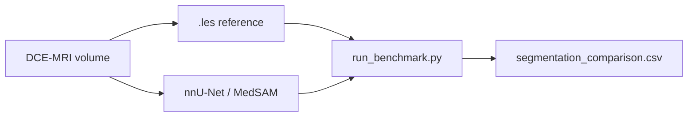

# Breast tumor segmentation — plan (Philip-Chandan)

Living doc for **automated focal lesion segmentation** on TCGA-Breast-Radiogenomics DCE-MRI. Primary deliverable: reproducible **3D tumor masks** `(Z, Y, X)` per patient/timepoint, with quantitative evaluation against radiologist ground truth.

Philip and Chandan work as one unit — same deliverables, same code.

---

## Mission

| Deliverable | Done when |
|-------------|-----------|
| **Segmentation benchmark** | Classical + DL methods compared on rev2 baselines vs TCIA `.les` |
| **Automated inference** | At least one non-heuristic method (MAMA-MIA nnU-Net) runs on full-res DCE-MRI |
| **Longitudinal masks** | Strategy + masks for follow-up timepoints (no expert `.les` available) |
| **QC + metrics** | Per-slug masks, comparison CSV, mid-z / 3D inspection artifacts |
| **Documented limitations** | What works, what fails, and why (orientation, phase, FOV) |

**Not the mission of this folder:** PyRadiomics feature extraction ([`../stretch/`](../stretch/)) or PDE prep ([`../../vinesh/prepare_pde_input.py`](../../vinesh/prepare_pde_input.py)). Those may **consume** segmentation outputs later; they do not drive this plan.

---

## Problem statement

Breast **lesion** segmentation on DCE-MRI is hard: small enhancing masses, heterogeneous protocols, and dynamic series geometry. Our current heuristic fails badly on rev2 primaries.

| Method | Rev2 baseline | Follow-up | Segmentation quality |
|--------|---------------|-----------|----------------------|
| **TCIA `.les`** | ~1.3k–2.7k voxels, expert | **Not published** | Ground truth for evaluation |
| **Aligned-bbox** | ~1.8k–4.7k voxels | pending | **Current** classical workflow — see [`../validation/run_aligned_bbox_workflow.py`](../validation/run_aligned_bbox_workflow.py) |
| ~~**Otsu + largest CC**~~ | Dice **0** vs `.les` | rejected | **Retired** — whole-breast bright regions |
| **nnU-Net (MAMA-MIA)** | pending | pending | **Next** — primary automated method |

Existing validation: [`../validation/VALIDATION.md`](../validation/VALIDATION.md), [`../PIPELINE_REPORT.pdf`](../PIPELINE_REPORT.pdf) Section 7.

**Core question:** Can we produce **automated** tumor boundaries that agree with expert `.les` on baseline, and **generalize** to follow-up where no expert mask exists?

---

## Dataset & ground truth

### Cohort (rev2)

| Subtype | TCGA ID | Baseline | Follow-up | Baseline `.les` |
|---------|---------|----------|-----------|-----------------|
| Luminal A | TCGA-AR-A1AX | 2002-09-12 | 2003-09-24 | `TCGA-AR-A1AX-S2-1.les` |
| Basal-like | TCGA-AR-A1AQ | 2001-11-21 | 2003-05-07 | `TCGA-AR-A1AQ-S2-1.les` |

### `.les` format (reference standard)

Expert **voxel-level** labels inside a 3D annotation cuboid — not a solid bounding box. Parser: [`../stretch/load_les_mask.py`](../stretch/load_les_mask.py).

- Annotated on **DCE sequence S2 = VIBRANT** when slice counts match raw extract
- ~91 patients in [TCGA Segmented Lesions archive](https://www.cancerimagingarchive.net/analysis-result/tcga-breast-radiogenomics/) — potential **training/eval pool** beyond rev2

**Why `.les` looks sparse (“dots”) in napari:** TCIA masks were not hand-painted 3D contours. Radiologists marked an approximate tumor **center**; the UChicago workstation (V2010) ran **fuzzy c-means** auto-segmentation and stored only FCM-positive voxels inside a small cuboid header (~31–34% cuboid fill for rev2). At full-breast scale (~352–464 slices) that cluster is tiny; viewing **later DCE phases** while the reference sits at **phase-1 z** makes it look even sparser. The cuboid bounds are the useful spatial prior; the sparse voxels are FCM seeds for validation, not a filled lesion outline.

**`cuboid_enhancement` (baseline spike):** Use `.les` cuboid ± margin for *where*, then local threshold + connected components on DCE phases 2–4 (subtraction when pre-contrast available) for *what*. See [`methods/cuboid_enhancement.py`](methods/cuboid_enhancement.py).

### Inputs per slug

```
data/processed/raw-extract-philip-chandan/{slug}.npy   # (Z,Y,X) float32 MR
data/processed/raw-extract-philip-chandan/{slug}.json  # spacing_mm, tcga_id, …
data/raw/tcia/…/                                     # DICOM (for nnU-Net preprocessing)
```

---

## Segmentation methods to evaluate



| ID | Method | Automated? | Baseline | Follow-up | Role in plan |
|----|--------|------------|----------|-----------|--------------|
| **`les`** | TCIA radiologist mask | No (reference) | **Written by harness** | N/A | **Ground truth** for metrics |
| **`cuboid_enhancement`** | `.les` cuboid + local enhancement (phases 2–4) | Yes | **done** — spike | N/A | Classical baseline prior to nnU-Net |
| **`nnunet`** | MAMA-MIA pretrained nnU-Net v2 on DCE-MRI | Yes | **Primary target** | **Primary target** | Drop `{slug}_nnunet_mask.npy` → re-run benchmark |
| **`medsam`** | MedSAM / SAM with box or point prompt | Semi | Optional spike | Optional spike | Same drop-in contract as nnU-Net |
| ~~**`otsu`**~~ | Percentile + Otsu + largest CC | Yes | — | — | **Out of scope** — failed validation; see [`../validation/VALIDATION.md`](../validation/VALIDATION.md) |
| **`breastdivider`** | Left/right breast nnU-Net | Yes | Preprocess only | Preprocess only | **Not lesion** — optional FOV narrowing |

### External references

- [MAMA-MIA benchmark](https://www.nature.com/articles/s41597-025-04707-4) — 1,506 expert segmentations; published nnU-Net weights (training included TCGA-BRCA); reported val Dice ~0.76 ± 0.21
- [nnU-Net v2](https://github.com/MIC-DKFZ/nnUNet) — inference framework
- [BreastDivider](https://github.com/MIC-DKFZ/BreastDivider) — anatomy only

---

## Repository layout

```
philip-chandan/segmentation/
├── PLAN.md
├── README.md
├── seg_paths.py                # done
├── load_volume.py              # done
├── ground_truth.py             # done — .les embed
├── segment.py                  # done — CLI (les reference; DL stubs)
├── evaluate.py                 # done — Dice / volume vs .les
├── run_benchmark.py            # done — reference + evaluate on-disk masks
├── qc_overlay.py               # done
├── methods/
│   ├── nnunet_mama_mia.py      # MAMA-MIA inference (planned)
│   └── medsam.py               # optional promptable spike (planned)
└── tests/test_evaluate.py      # done

data/processed/segmentation-philip-chandan/
data/qc/segmentation-philip-chandan/
data/models/segmentation-philip-chandan/   # nnU-Net weights (gitignored)
```

**Reuse (do not duplicate):** [`../stretch/load_les_mask.py`](../stretch/load_les_mask.py), [`../stretch/validate_segmentation.py`](../stretch/validate_segmentation.py) (`pick_dce_series`, Dice helpers).

---

## Phases

| Phase | Focus | Status |
|-------|-------|--------|
| **0** | Scaffold (`paths.py`, docs) | **done** |
| **1** | Benchmark harness — `.les` reference, `evaluate.py`, `run_benchmark.py`, QC | **done** |
| **2** | Automated DL — MAMA-MIA nnU-Net inference on rev2 baselines | **next** |
| **3** | Longitudinal — automated masks on follow-ups (no `.les`) | pending |
| **4** | Scale eval — optional benchmark on additional TCIA `.les` patients | pending |

~~Classical Otsu baseline~~ — **skipped**; already failed validation (whole-breast regions). Historical metrics remain in [`../validation/VALIDATION.md`](../validation/VALIDATION.md).

---

## Phase 1 — Benchmark harness (done)

**Run:**

```bash
cd breast-cancer-sim
.venv/bin/python simulation-vinesh-philip-chandan/philip-chandan/segmentation/run_benchmark.py --all-primary
```

**What it does:**

1. Embeds `.les` on the annotated DCE series (VIBRANT S2) → `{slug}_les_mask.npy` + JSON sidecar
2. Saves reference QC overlay under `data/qc/segmentation-philip-chandan/`
3. For each on-disk `{slug}_{method}_mask.npy` where `method` ∈ `nnunet`, `medsam`: computes Dice vs `.les`, writes row to `segmentation_comparison.csv`

**Acceptance (rev2 baselines):** voxel counts ≈ 1,321 (A1AX) and 2,742 (A1AQ).

**Inspect in 3D:**

```bash
.venv/bin/python simulation-vinesh-philip-chandan/philip-chandan/validation/view_les_napari.py \
  --slug luminal_a_TCGA-AR-A1AX_baseline
```

---

## Phase 2 — Automated deep learning (MAMA-MIA nnU-Net)

**Goal:** First credible **automated** lesion segmentation on our DCE-MRI.

### Setup (local, gitignored)

```bash
cd breast-cancer-sim
.venv/bin/pip install nnunetv2 torch
# Download MAMA-MIA weights → data/models/segmentation-philip-chandan/mama-mia-nnunet/
```

Pin download URL + checksum in `methods/nnunet_mama_mia.py` once verified.

### Inference pipeline

1. **Input:** DICOM series for annotated DCE phase (or NIfTI exported from raw extract + spacing)
2. **Preprocess:** nnU-Net v2 resampling / orientation (document any flips vs our `(Z,Y,X)` convention)
3. **Predict:** `nnUNetv2_predict_from_modelfolder` or Python API
4. **Postprocess:** map prediction back to raw extract voxel grid
5. **Output:** `{slug}_nnunet_mask.npy` → re-run `run_benchmark.py`

### Acceptance (Phase 2 spike)

| Slug | Target |
|------|--------|
| `basal_TCGA-AR-A1AQ_baseline` | Dice vs `.les` reported; QC overlay saved |
| `luminal_a_TCGA-AR-A1AX_baseline` | Same |

**Success bar:** Dice **> 0** vs `.les`; aspirational Dice **> 0.5** on at least one case.

### `cuboid_enhancement` spike results (rev2 baselines)

| Slug | Dice | Area (pred / `.les`) | Selected phase | Notes |
|------|------|----------------------|----------------|-------|
| `luminal_a_TCGA-AR-A1AX_baseline` | **0.233** | 5.0× | 1 | Cuboid ROI + local threshold; volume capped at 5× expert |
| `basal_TCGA-AR-A1AQ_baseline` | **0.211** | 5.0× | 1 | Cuboid ROI + local threshold |

Run: `segment.py --method cuboid_enhancement` then `run_benchmark.py --all-primary`. Napari QC: `view_les_napari.py --slug … --cuboid-enhancement`.

### Risks

| Risk | Mitigation |
|------|------------|
| DCE phase mismatch | Use VIBRANT (S2); document which temporal phase nnU-Net expects |
| Axial vs sagittal training mix | Check prediction on our axial stacks; note in report |
| Heavy deps / GPU | CPU OK for spike; batch later |
| Grid alignment | Unit test: mask shape == raw extract shape |

---

## Phase 3 — Longitudinal segmentation (follow-ups)

Expert `.les` exist for **baseline only**. Follow-ups require a purely automated path.

| Priority | Strategy | Notes |
|----------|----------|-------|
| **1** | **nnU-Net inference** on follow-up DCE | Same model as Phase 2; plausibility check (volume change, location) |
| **2** | **Registration** — warp baseline `.les` to follow-up | SimpleITK rigid/affine; spike if nnU-Net fails |
| **3** | **MedSAM** with box from nnU-Net or enhancement peak | Refinement layer |

**Acceptance:** `{slug}_nnunet_mask.npy` for all four rev2 slugs; longitudinal volume table (no Dice — no ground truth).

---

## Phase 4 — Scale evaluation (optional)

Expand benchmark beyond rev2 using the full **91-patient `.les` archive**:

- Patients with local DICOM + `.les` on TCIA
- Aggregate Dice distribution per method
- Informs whether to **fine-tune** nnU-Net on TCIA `.les` (future work, not hackathon-critical)

---

## Tests

- [`tests/test_evaluate.py`](tests/test_evaluate.py) — Dice on synthetic overlap (**done**)
- Reuse [`../stretch/tests/test_load_les_mask.py`](../stretch/tests/test_load_les_mask.py) for `.les` round-trip

---

## Dependencies

| Package | Phase | In default `requirements.txt`? |
|---------|-------|-------------------------------|
| numpy, scipy, scikit-image, SimpleITK | 1–2 | yes |
| napari | 3D QC | yes |
| **nnunetv2**, torch | 2 | **no** — install when running DL phase |
| medsam | optional | no |

Use `breast-cancer-sim/.venv/bin/python` per project venv rules.

---

## Isolation

- All new code under `philip-chandan/segmentation/`
- Read-only: raw extracts, manifest, DICOM, `.les`
- Write-only: `data/processed/segmentation-philip-chandan/`, `data/qc/segmentation-philip-chandan/`
- Do **not** edit `vinesh/` without coordinating with Vinesh
- Do **not** block on `stretch/` — radiomics can adopt masks later via manifest path if team agrees

---

## Success criteria

| Milestone | Done when |
|-----------|-----------|
| **M1 — Benchmark harness** | **done** — `.les` refs + QC on rev2 baselines |
| **M2 — nnU-Net baseline** | `{slug}_nnunet_mask.npy` + Dice row in comparison CSV |
| **M3 — Longitudinal** | nnU-Net masks for both follow-up slugs |
| **M4 — Reportable** | QC PNGs + pipeline report Section 7 updated |

---

## Immediate next steps

1. **Phase 2** — `methods/nnunet_mama_mia.py` spike on `basal_TCGA-AR-A1AQ_baseline`
2. Re-run **`run_benchmark.py`** after nnU-Net mask lands
3. **Phase 3** — same model on follow-ups if baseline Dice is acceptable

---

## Downstream consumers (optional, not drivers)

| Consumer | How they might use masks |
|----------|-------------------------|
| **PDE / Vinesh** | PDE inputs delivered; optional binary ROI handoff if solver contract changes |
| **Radiomics / stretch** | ROI input — separate team decision |
| **Jasim / UI** | Tumor surface overlay on full-res MR |
| **Praneeth** | Imaging phenotype joins — only after segmentation validated |

---

## Coordination

| Who | When | Message |
|-----|------|---------|
| **Team** | M2 | Benchmark CSV + QC overlays |
| **Vinesh** | If PDE wants better initial mask | New mask path + shape convention |
| **Validation doc** | Each milestone | Update [`../validation/VALIDATION.md`](../validation/VALIDATION.md) |

---

## References

- TCIA `.les`: [`../validation/VALIDATION.md`](../validation/VALIDATION.md)
- MAMA-MIA: [Scientific Data 2025](https://www.nature.com/articles/s41597-025-04707-4)
- nnU-Net v2: [MIC-DKFZ/nnUNet](https://github.com/MIC-DKFZ/nnUNet)
